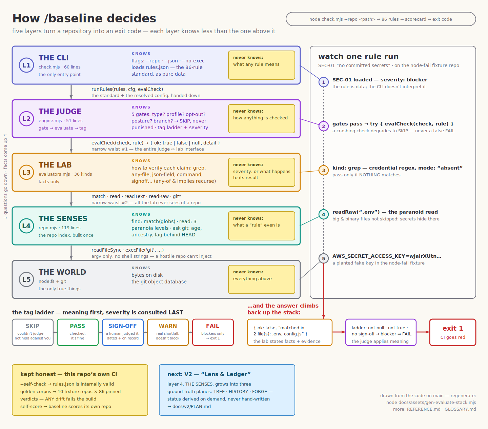

# baseline-skill

The **`baseline`** skill for **Hermes** and **Claude Code** (and any agent that loads
`SKILL.md`): a zero-dependency project-readiness checker packaged as an installable skill. It scores a repository
against **87 rules** across build, tests, security & [supply-chain](GLOSSARY.md#supply-chain), reproducibility,
operability, change governance, community, context/doc-drift, claims discipline,
records & ledger, lane workflow, and divergence —
[blockers](GLOSSARY.md#blocker) fail CI, judgment calls resolve via a dated [sign-off ledger](GLOSSARY.md#sign-off-ledger).

> The premise: *don't trust a written promise — make something check it.*

<picture>
  <source media="(prefers-color-scheme: dark)" srcset="docs/assets/evaluate-stack-dark.svg">
  
</picture>

*How a repository becomes an exit code — the [full reference](REFERENCE.md) walks every layer.*

New to the jargon? The [glossary](GLOSSARY.md) defines the DevOps and supply-chain terms in plain language.

## Install

```bash
git clone https://github.com/AdarGit008/baseline-skill
cd baseline-skill

./install.sh                # Claude Code -> ~/.claude/skills/baseline
./install.sh --hermes       # Hermes      -> ~/.hermes/skills/software-development/baseline
./install.sh /custom/path   # any custom skills dir
```

Then in any repo say **"run baseline"** / **"score this repo"** (Claude Code: `/baseline`)
— the agent runs the checker, reads the scorecard, and helps fix or scaffold what's
missing. Restart Claude Code, or start a **new Hermes session** (its skill loader is
cached per session), for the skill to appear.

`SKILL.md` follows the Hermes peer conventions (frontmatter + structure) and stays
valid for Claude Code, so the one repo is native to both.

## Run it directly (no agent)

```bash
node baseline.mjs --repo /path/to/repo          # score (the default command) — exit 1 on blockers
node baseline.mjs --repo /path/to/repo --json   # machine output for CI
node baseline.mjs admit --repo /path/to/repo    # merge-point revalidation — exit 1 = refused (stale / blocker)
node baseline.mjs orient --repo /path/to/repo   # derived-state survey: lanes · backlog · divergence
node baseline.mjs log -m "..." --next "..."     # write a scrubbed session record (the forensic tier)
node baseline.mjs jdg check                     # evaluate the judgment ledger: tripwires · expiry · drift
node baseline.mjs gen migrate-claims            # explode a legacy docs/CLAIMS.json into records/claims/CLM-*.json
node baseline.mjs scrub --pushed <sha>          # scan record content for secret shapes (the pre-push hook's engine)
```

`baseline.mjs` is the entry point — `check` is the default (it delegates to `check.mjs`, still the checker), and `orient` surveys session state. Needs only Node ≥ 18 and git; `orient`'s forge view also uses `gh` and degrades gracefully without it.

## What's inside

| file | purpose |
|---|---|
| `SKILL.md` | the skill definition (modes: orient / score / init / fix / explain) |
| `CONTRACT.md` | the plain-git twin: what the workflow expects of a repo, no tool required |
| `baseline.mjs` | the CLI entry point — `check`, `admit`, `reconcile`, `orient`, `lane`, `log`, `jdg`, `gen`, `scrub`, `help` |
| `check.mjs` | the checker (`baseline check` delegates here) |
| `src/` | the runner's modules: repo · config · evaluators · engine · report · self-check · descriptor · probe · orient · rules · records · validate · scrub · log · jdg |
| `test/` | golden corpus + orient/facts/records suites (`test/golden/run.mjs --verify`, `test/{orient,facts,records}/run.mjs`) — source repo only, not installed |
| `rules.json` | the rule-set manifest (version, profiles, module list) — the 87 rules live in `rules/` |
| `rules/` | the rules, one module per category (build, test, ctx, … desc); M5+ families land as new files |
| `schema/` | `repo.schema.json` (the descriptor) + `record.{session,judgment,claim,adr}.schema.json` (the Ledger's shapes) |
| `config.example.json` | per-repo config (copy to `baseline.config.json`) |
| `templates/` | scaffolds: baseline.repo.json, session-log.md, judgment.json, claim.json, adr.md, doc-with-freshness.md |
| `config-presets/` | ready-made `baseline.config.json` + `*.repo.json` posture presets (multi-lane-agents, readiness-only, node-service, …) |
| `hooks/` | Claude Code SessionStart hook that runs `baseline orient`, plus `scrub-pre-push.sh` (pre-push records scrub scaffold) |
| `README.md` | this guide — install, usage, file map |
| `REFERENCE.md` | full reference: rule table, categories, architecture diagrams, CI wiring |
| `GLOSSARY.md` | plain-language definitions of the DevOps/supply-chain terms |

See **[REFERENCE.md](REFERENCE.md)** for the full rule table, category
descriptions, architecture/flow diagrams, and the CI wiring snippet.

## V2 — Lens & Ledger (in progress)

A full redesign around **derived state** is planned and underway — the checker computes
status/lanes/orientation from ground truth (tree · git history · forge) instead of checking
stored proxies. Plan of record: **[docs/v2/PLAN.md](https://github.com/AdarGit008/baseline-skill/blob/main/docs/v2/PLAN.md)**; the verified concept
register behind it: **[docs/v2/CONCEPTS.md](https://github.com/AdarGit008/baseline-skill/blob/main/docs/v2/CONCEPTS.md)**.
<!-- absolute URLs on purpose: this README ships vendored (install.sh) without docs/, and a
     relative link would fail every consumer's CTX-05 broken-link gate — found dogfooding on baseline-demo -->> Work is tracked in the
[V2.0 milestone](https://github.com/AdarGit008/baseline-skill/milestone/1) (modules M1–M7,
expand/contract — removal last).

## See it pass

[AdarGit008/baseline-demo](https://github.com/AdarGit008/baseline-demo) is a reference
repo that scores a perfect 0-blockers / 100% against this standard.

## License

MIT
