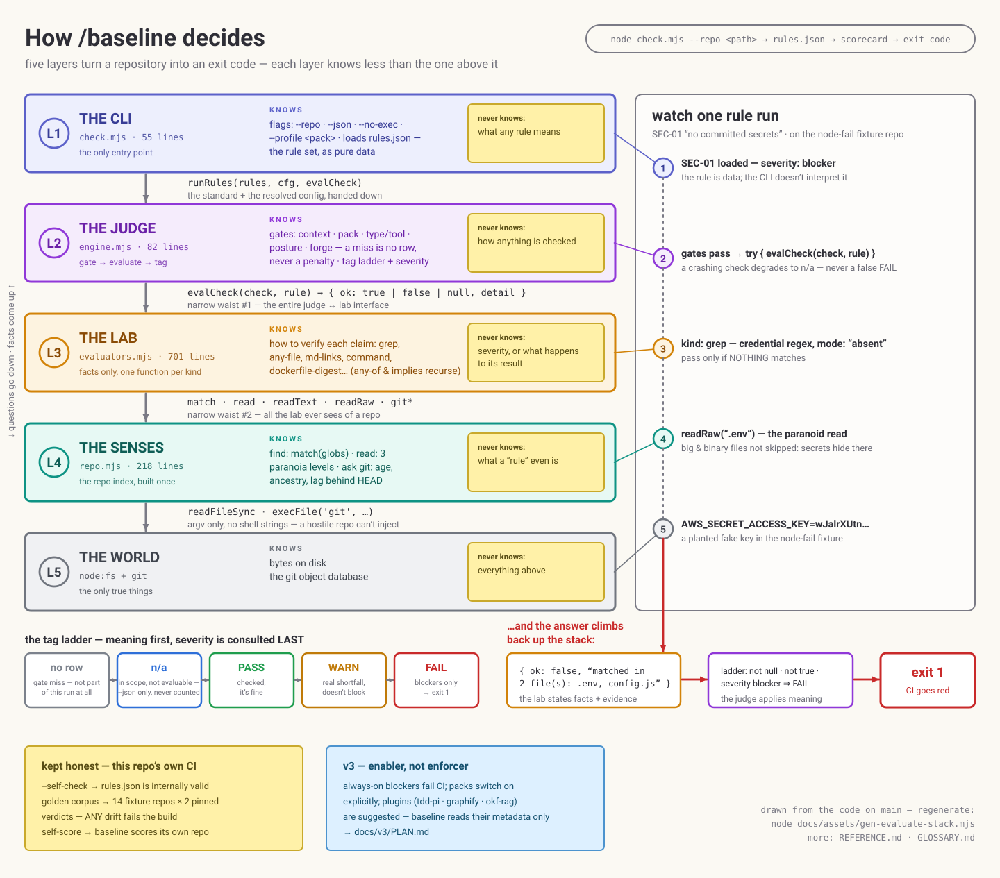

# baseline-skill

The **`baseline`** skill for **Claude Code** and **Hermes** (and any agent that loads
`SKILL.md`): a zero-dependency project-readiness checker packaged as an installable skill.
It scores a repository against **the rule set** (`node check.mjs --self-check` prints its
size) across build, tests, security & [supply-chain](GLOSSARY.md#supply-chain),
reproducibility, operability, change governance, community, context/doc-drift, claims
discipline, records, the repo descriptor, and the three plugins —
[blockers](GLOSSARY.md#blocker) fail CI, everything else [warns](GLOSSARY.md#warn).

> The premise: *don't trust a written promise — make something check it.*

v3 is **scaffolding, not an enforcer**: only the always-on blockers can fail a build;
[packs](GLOSSARY.md#pack) run only from an explicit switch in `baseline.config.json`; and the
three [plugins](GLOSSARY.md#plugin) — **tdd-pi** (what is open), **graphify** (what is
where), **okf-rag** (why it matters) — are *suggested*, never required: baseline reads their
artifacts as metadata only and never opens them.

<picture>
  <source media="(prefers-color-scheme: dark)" srcset="docs/assets/evaluate-stack-dark.svg">
  
</picture>

*How a repository becomes an exit code — the [full reference](REFERENCE.md) walks every layer.*

New to the jargon? The [glossary](GLOSSARY.md) defines the DevOps and supply-chain terms in plain language.

## Install

```bash
git clone https://github.com/AdarGit008/baseline-skill
cd baseline-skill

./install.sh                        # Claude Code -> ~/.claude/skills/baseline
./install.sh --hermes               # Hermes      -> ~/.hermes/skills/software-development/baseline
./install.sh /custom/path           # any custom skills dir
./install.sh --with-session-hook    # also ship hooks/orient-session-start.sh (opt-in; wiring stays by hand)
```

Then in any repo say **"run baseline"** / **"score this repo"** (Claude Code: `/baseline`)
— the agent runs the checker, reads the scorecard, and helps fix what's missing. Restart
Claude Code, or start a **new Hermes session** (its skill loader is cached per session),
for the skill to appear. The default install ships no session-start wiring; `install.sh`
never edits an agent's own settings — see [`hooks/README.md`](hooks/README.md).

`SKILL.md` is one page: what baseline does, the one command, the modes (orient / score /
fix / explain), the always-on blockers by name, the three plugins, and "everything else,
ask `get_knowledge`". It follows the Hermes peer conventions and stays valid for Claude
Code, so the one repo is native to both.

## Run it directly (no agent)

```bash
node baseline.mjs --repo /path/to/repo             # score (the default command) — exit 1 on an always-on blocker
node baseline.mjs --repo /path/to/repo --json      # machine output for CI: rows are {id, tag, detail} or {id, state: "n/a", reason}
node baseline.mjs check --self-check               # validate the rule set; print the derived counts and coverage matrix
node baseline.mjs orient --repo /path/to/repo      # five lines: repo · work · graph · knowledge · score — read-only, exit 0 always
node baseline.mjs explain SEC-01                   # what a rule checks and why (+ the okf concept when BASELINE_OKF_BUNDLE names a bundle)
node baseline.mjs explain --audit                  # every rule id resolves to a concept file in the bundle (by filename; exit 1 on a hole)
node baseline.mjs gen okf-concepts                 # stage one proposed okf concept per rule under .baseline/proposed/ (deterministic; never the bundle)
node baseline.mjs gen migrate-claims               # explode a legacy docs/CLAIMS.json into records/claims/CLM-*.json
node baseline.mjs log -m "..." --next "..."        # write a scrubbed session record
node baseline.mjs scrub --pushed <sha>             # scan committed content for secret shapes (the pre-push hook's engine)
```

`baseline.mjs` is the entry point — `check` is the default (it delegates to `check.mjs`,
still the checker). Needs only Node ≥ 18 and git. `check` and `orient` never touch the
forge and never spawn `gh`; `admit` and `reconcile` (the merge-time verbs kept from v2) do.

## What's inside

| file | purpose |
|---|---|
| `SKILL.md` | the skill definition, one page (modes: orient / score / fix / explain) |
| `CONTRACT.md` | the plain-git twin: what baseline expects of a repo, no tool required |
| `baseline.mjs` | the CLI entry point — `check`, `orient`, `explain`, `gen`, `admit`, `reconcile`, `log`, `jdg`, `scrub`, `help` |
| `check.mjs` | the checker (`baseline check` delegates here) |
| `src/` | the runner's modules: repo · config · evaluators · engine · report · self-check · descriptor · orient · explain · rules · records · scrub · gen |
| `rules.json` | the rule-set manifest (version, packs, module list) — the rules live in `rules/` |
| `rules/` | the rules, one module per category (build, test, ctx, … desc, plug) |
| `schema/` | `repo.schema.json` (the descriptor) + `record.{session,judgment,claim,adr}.schema.json` |
| `config.example.json` | per-repo config (copy to `baseline.config.json`): packs, `want`, `plugins`, paths, commands |
| `templates/` | scaffolds: baseline.repo.json, session-log.md, judgment.json, claim.json, adr.md, doc-with-freshness.md |
| `config-presets/` | ready-made `baseline.config.json` + `*.repo.json` presets |
| `hooks/` | `scrub-pre-push.sh` (ships by default) and the opt-in `orient-session-start.sh` |
| `docs/assets/` | the diagram above and the REFERENCE.md rule-table generator — both derive from the code; rerun after a change |
| `test/` | the suites — source repo only, not installed |
| `README.md` | this guide — install, usage, file map |
| `REFERENCE.md` | full reference: packs, scope, plugins, architecture, the generated rule table, CI wiring |
| `GLOSSARY.md` | plain-language definitions of the DevOps/supply-chain terms |

See **[REFERENCE.md](REFERENCE.md)** for the pack switches, the `plugins` / `want` config
keys, the `--json` shape, the rule table and the CI wiring snippet.

## v3 — enabler, not enforcer

The plan of record is **[docs/v3/PLAN.md](https://github.com/AdarGit008/baseline-skill/blob/main/docs/v3/PLAN.md)**,
and the tests under `test/red/` are its authority: where the plan and a test disagree, the
test wins. In short — three-part rule ids (`SEC-01-no-committed-secrets`); the lane,
divergence and merge-admission families deleted with their machinery; every manual rule
deleted; packs from explicit switches only; `tool` / `want` scope the run to what the repo
uses; the forge closed under `check` and `orient`; one WARN per absent plugin, with a log
under `.baseline/log/`; `explain` and `gen okf-concepts` as the only knowledge seams; every
count derived, never written down.
<!-- absolute URL on purpose: this README ships vendored (install.sh) without docs/, and a
     relative link would fail every consumer's CTX-05 broken-link gate -->

## See it pass — the worked example

[**AdarGit008/baseline-demo**](https://github.com/AdarGit008/baseline-demo) is this
standard applied to a real repo, end to end — the dogfood, so this repo can stay the tool.
It vendors the toolkit under `tools/baseline/` and runs `check` as a required CI job.
baseline-skill itself keeps a deliberately minimal self-score (it is a zero-dep
docs/distribution repo).

## License

MIT
