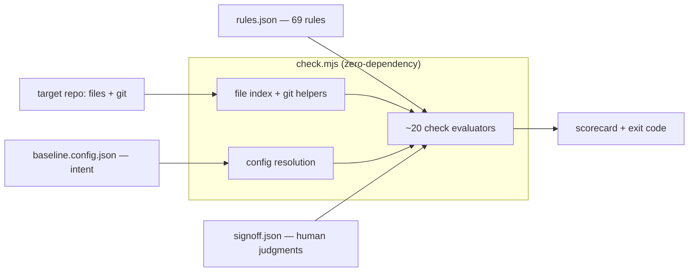
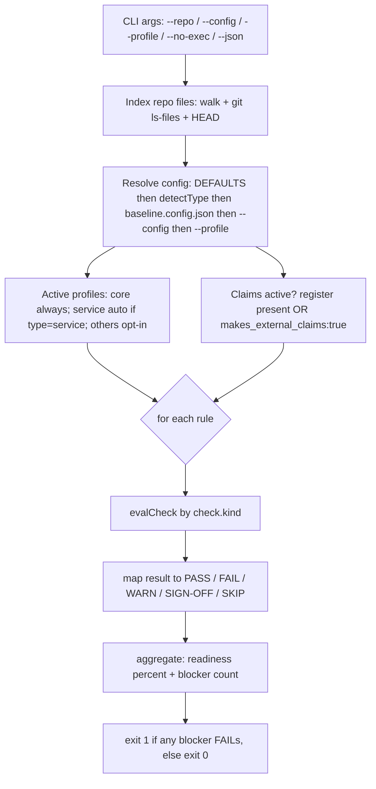
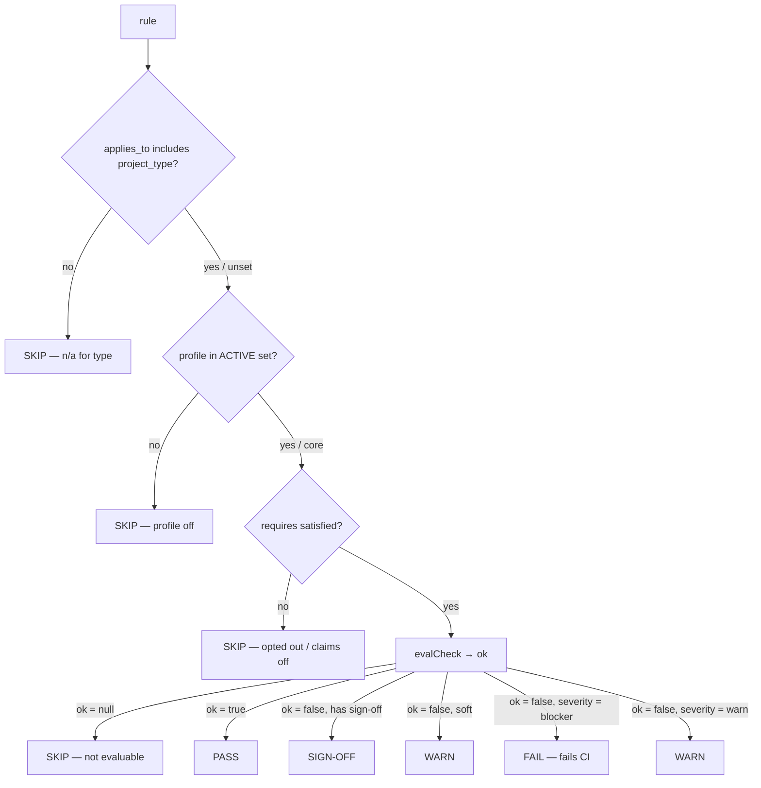

# project-baseline v2 (2.1)

A **testable readiness standard** for new projects. Every lesson is a rule; a zero-dependency runner scores a repo and **fails CI on the blockers**. The judgment calls a script can't make become a dated **[sign-off ledger](GLOSSARY.md#sign-off-ledger)** — so even those leave a checkable trace.

> The throughline: *don't trust a written promise — make something check it.* A checklist doc would just become another thing that drifts. This is the checklist as an exit code.

> **New to the jargon?** Terms like [SBOM](GLOSSARY.md#sbom), [SLSA](GLOSSARY.md#slsa), [provenance](GLOSSARY.md#provenance), and [sign-off ledger](GLOSSARY.md#sign-off-ledger) are defined in the [glossary](GLOSSARY.md).

**v1** distilled 20 rules from three of the author's own repos. That sample was thin. **v2** pressure-tested v1 against the field's actual prior art — [OpenSSF Scorecard](GLOSSARY.md#openssf-scorecard), [SLSA](GLOSSARY.md#slsa), the [Twelve-Factor App](GLOSSARY.md#twelve-factor-app), Google's SRE books, [Diátaxis](GLOSSARY.md#diataxis), [Keep a Changelog](GLOSSARY.md#keep-a-changelog), [repolinter](GLOSSARY.md#repolinter), [Backstage/Cortex/OpsLevel](GLOSSARY.md#service-catalog), Stryker, and ~40 more sources — kept everything v1 had, and added what the field agreed v1 was missing. Each candidate was **adversarially verified** (is the source real? is it robot-checkable at rest? does it actually add over v1?) before it earned a place; 15 "looks-thorough-checks-nothing" candidates were dropped.

**69 rules across 10 categories.** 14 blockers · 50 warnings · 5 sign-offs.

## Profiles — v2 stays sharp by only running what fits

Not every rule fits every repo. A pre-code planning repo shouldn't be nagged about health endpoints; a CLI shouldn't be told to publish an [SBOM](GLOSSARY.md#sbom). So rules carry a **[profile](GLOSSARY.md#profile)**:

- **core** (54 rules) — always on. Universal, high-confidence, machine-checkable.
- **service** (6 rules) — **auto-on when `project_type=service`.** Operability rules ([health check](GLOSSARY.md#health-check), [structured logs](GLOSSARY.md#structured-logging), [graceful shutdown](GLOSSARY.md#graceful-shutdown), [runbook](GLOSSARY.md#runbook)) that only make sense for a running service.
- **advanced** (9 rules) — **opt-in** via `config.profiles: ["advanced"]`. Expert/niche rules (SBOM, [code-scanning](GLOSSARY.md#sast), [mutation testing](GLOSSARY.md#mutation-testing), symbol-integrity) that would be noise on most repos.

A rule that doesn't apply to your `project_type` or active profile **skips** (shown as `n/a`) — it never counts against you. That's how the standard grew 3× in rules without getting 3× naggier on any single repo.

## Project types & `applies_to`

A profile decides *how expert* a rule is; **`applies_to`** decides *what kind of repo* it fits. Every rule declares one, checked against a closed set of project types:

`node` · `python` · `service` · `library` · `docs`

- `applies_to: "all"` — universal (secrets, LICENSE, broken-links, claims, doc-drift…).
- `applies_to: ["node","python","service","library"]` — **code repos only** (build/test/lint/reproducibility rules); a `docs` repo skips them.
- `applies_to: ["service"]` — long-running **services only** (the OPS rules).

`project_type` auto-detects (`package.json` ⇒ `node`/`service`, `pyproject.toml` ⇒ `python`, else `docs`) and can be pinned in `baseline.config.json`. A rule whose `applies_to` doesn't include your type **skips** as `n/a`, exactly like an off profile.

**Integrity gate — so a scope can't silently dangle.** A mistyped scope (`"nodejs"`, `"doc"`) would make a rule quietly never run. The rule set validates itself:

```bash
node check.mjs --self-check
```

It exits 1 on any rule missing `applies_to`, or naming an unknown type / profile / check-kind / severity / category / `requires` key, a duplicate id, or an orphan type/profile — and prints a **coverage matrix** (how many rules apply to each type). Wire it into CI so a malformed `rules.json` can't merge.

## Why it's shaped this way

Three failure layers showed up across the original repos, and the drift **climbs** as a project matures:
- **Code / tests / CI** — broken in the pre-code repos (no scaffolding, Task 1 couldn't run), solid in the mature one.
- **Narrative docs** — became the mature repo's #1 risk (stale resume marker, un-superseded ADR).
- **Headline claims** — falsified in the pre-code repos by shipping prior art.

v1 covered those three layers well. v2 adds the layers a *shipping* repo lives or dies on — **security & supply-chain, reproducibility, operability, code-quality gates, change governance** — plus deeper **context/doc-drift** checks (dead links, doc freshness, generated-file provenance). The bias is unchanged: everything a machine can verify, biased toward blocking the things that are unambiguous.

## Architecture & data flow

These diagrams mirror `check.mjs` — they're the runner's actual control flow, not a sketch. The whole thing is one zero-dependency Node file: it indexes the repo, resolves config, then walks every rule through the same gate → evaluate → tag pipeline.

**The components.** Three inputs (your config, the rule set, the target repo) feed one engine; a human [sign-off ledger](GLOSSARY.md#sign-off-ledger) covers the judgments a script can't make.



**The run.** One pass: build the file index and git state, resolve config (defaults → auto-detected `project_type` → `baseline.config.json` → `--config` → `--profile`), decide which [profiles](GLOSSARY.md#profile) are active, then score every rule and reduce to a readiness % and an [exit code](GLOSSARY.md#exit-code).



**Per-rule gate → tag.** Every rule runs the same funnel. Three gates can short-circuit it to `SKIP` (wrong type, off profile, opted out) before the check ever runs; only a `blocker` that evaluates to `false` fails CI.



## Quickstart
```bash
# 1. drop the toolkit in (e.g. tools/baseline/)
cp -r baseline-v2 tools/baseline

# 2. declare intent (copy + edit)
cp tools/baseline/config.example.json baseline.config.json

# 3. scaffold the artifacts the standard expects
cp tools/baseline/templates/CLAIMS.json   docs/CLAIMS.json
cp tools/baseline/templates/start-here.md docs/start-here.md
mkdir -p .project-baseline && cp tools/baseline/templates/signoff.json .project-baseline/signoff.json

# 4. run it
node tools/baseline/check.mjs                 # human-readable scorecard, exit 1 on blockers
node tools/baseline/check.mjs --json          # machine output for CI
node tools/baseline/check.mjs --no-exec       # skip the clean-checkout command (BUILD-05)
node tools/baseline/check.mjs --profile advanced   # opt into the advanced rules
```
No install, no dependencies — needs only Node ≥ 18 and `git`.

## Wire it into CI (the point)
```yaml
  baseline:
    runs-on: ubuntu-latest
    steps:
      - uses: actions/checkout@<sha>
      - uses: actions/setup-node@<sha>
        with: { node-version: 22 }
      - run: node tools/baseline/check.mjs      # drop --no-exec so BUILD-05 runs the real Task 1
```
Make `baseline` a required status check. Now the standard can't rot — it's enforced on every PR. (That's rule **BUILD-06**, checking itself.)

## Configuration

Everything auto-detects; override only what you need in `baseline.config.json` (see `config.example.json`). Keys that matter for v2:

| key | what it does |
|---|---|
| `project_type` | `node`\|`service`\|`python`\|`library`\|`docs`. `service` auto-enables the OPS rules. |
| `profiles` | extra profiles beyond core, e.g. `["advanced"]`. |
| `makes_external_claims` | `false` skips all CLAIM-* rules (internal tool with no competitive/novelty claims). |
| `bootstrap_command` | the clean-checkout Task-1 command (BUILD-05); must exit 0. |
| `freshness_globs` | **opt-in** for CTX-06 — docs that must carry a `last_review_date`. Empty = rule skips. |
| `generated_globs` | **opt-in** for CTX-08 — generated files that must carry a `DO NOT EDIT` marker. Empty = rule skips. |
| `grounding_docs` | **opt-in** for CTX-09 — required docs that must exist + be non-empty. Empty = rule skips. |
| `decision_globs` / `doc_globs` | where ADR-status/forward-link and link/path checks look. |
| `stamp_max_lag_commits` | CTX-01 accepts a status stamp naming HEAD or an ancestor within this many commits (default 3); off-branch/bogus fails, honest-but-older warns. |
| `doc_lag_days` | CTX-11 warns when a doc's anchored `sources:` code was committed more than this many days after the doc (default 30). |

The three opt-in `*_globs` keys default to empty, so those rules stay silent until you adopt the convention — no nagging a repo that hasn't opted in.

## The rules

[`blocker`](GLOSSARY.md#blocker) fails CI · [`warn`](GLOSSARY.md#warn) is advisory · [`sign-off`](GLOSSARY.md#sign-off-ledger) (manual) is satisfied only by a dated entry in `.project-baseline/signoff.json`.

<!-- generated from rules.json; regenerate if rules change -->
### Build & execution (10)

| ID | Rule | Severity | Profile |
|---|---|---|---|
| BUILD-01 | Dependency manifest present | 🔴 blocker | core |
| BUILD-02 | Lockfile committed | 🟡 warn | core |
| BUILD-03 | CI workflow present | 🔴 blocker | core |
| BUILD-04 | Env/secret template present | 🟡 warn | core |
| BUILD-05 | Task 1 passes on a clean checkout | 🔴 blocker | core |
| BUILD-06 | Baseline gate wired into CI | 🟡 warn | core |
| BUILD-07 | A single documented bootstrap entrypoint exists | 🟡 warn | core |
| BUILD-08 | Standard task commands are declared machine-readably | 🟡 warn | core |
| BUILD-09 | Bootstrap is idempotent (safe to re-run) | 🟡 warn | advanced |
| BUILD-10 | CI actually invokes the test suite | 🟡 warn | core |

### Code quality (4)

| ID | Rule | Severity | Profile |
|---|---|---|---|
| QUAL-01 | A linter is configured | 🟡 warn | core |
| QUAL-02 | A formatter is configured | 🟡 warn | core |
| QUAL-03 | Type-checking is strict where supported | 🟡 warn | core |
| QUAL-04 | The linter is actually enforced (run in CI or pre-commit) | 🟡 warn | core |

### Tests & invariants (7)

| ID | Rule | Severity | Profile |
|---|---|---|---|
| TEST-01 | Automated tests exist | 🔴 blocker | core |
| TEST-02 | Failure paths are tested (negative tests) | 🟡 warn | core |
| TEST-03 | Red-on-arrival guards for 'must-never-exist' invariants | ✍️ sign-off | core |
| TEST-04 | Acceptance criteria reconciled against reference code | ✍️ sign-off | core |
| TEST-05 | Mutation testing, if used, is gated | 🟡 warn | advanced |
| TEST-06 | Flaky-test quarantine is disciplined | ✍️ sign-off | advanced |
| TEST-07 | A coverage floor is declared and enforced | 🟡 warn | advanced |

### Security & supply-chain (14)

| ID | Rule | Severity | Profile |
|---|---|---|---|
| SEC-01 | No high-signal secrets committed | 🔴 blocker | core |
| SEC-02 | Real .env files are git-ignored, not committed | 🔴 blocker | core |
| SEC-03 | Third-party CI actions pinned to a commit SHA | 🟡 warn | core |
| SEC-04 | No dangerous CI workflow patterns | 🟡 warn | core |
| SEC-05 | Automated dependency-update tool configured | 🟡 warn | core |
| SEC-06 | Security policy names a reporting channel | 🟡 warn | core |
| SEC-07 | No committed binary/executable artifacts | 🟡 warn | core |
| SEC-08 | A committed SBOM exists in a recognized format | 🟡 warn | advanced |
| SEC-09 | Static code-scanning is configured | 🟡 warn | advanced |
| SEC-10 | Release provenance/signing is present | 🟡 warn | advanced |
| SEC-11 | CI grants a least-privilege GITHUB_TOKEN | 🟡 warn | core |
| SEC-12 | A secret-scanning gate is wired in | 🟡 warn | core |
| SEC-13 | A dependency vulnerability scan runs in CI | 🟡 warn | advanced |
| SEC-14 | Pre-commit hooks pinned to an immutable rev | 🟡 warn | core |

### Reproducibility (4)

| ID | Rule | Severity | Profile |
|---|---|---|---|
| REPRO-01 | CI installs dependencies in frozen/locked mode | 🟡 warn | core |
| REPRO-02 | Runtime version is pinned | 🟡 warn | core |
| REPRO-03 | Pinned runtime version is consistent everywhere | 🟡 warn | core |
| REPRO-04 | Dockerfile base images pinned by digest | 🟡 warn | core |

### Operability (service) (6)

| ID | Rule | Severity | Profile |
|---|---|---|---|
| OPS-01 | Structured logging is wired in | 🟡 warn | service |
| OPS-02 | A health/readiness endpoint exists | 🟡 warn | service |
| OPS-03 | Graceful shutdown on SIGTERM | 🟡 warn | service |
| OPS-04 | Outbound calls are time-bounded/guarded | 🟡 warn | service |
| OPS-05 | An operational runbook exists | 🟡 warn | service |
| OPS-06 | A service descriptor declares owner + lifecycle | 🟡 warn | service |

### Change governance (3)

| ID | Rule | Severity | Profile |
|---|---|---|---|
| GOV-01 | Merge protection is declared in-repo | 🟡 warn | core |
| GOV-02 | Strict/up-to-date merges and conversation resolution enabled | 🟡 warn | core |
| GOV-03 | CODEOWNERS exists and names an owner | 🟡 warn | core |

### Community & onboarding (3)

| ID | Rule | Severity | Profile |
|---|---|---|---|
| COMM-01 | LICENSE file present | 🔴 blocker | core |
| COMM-02 | README exists with newcomer-critical sections | 🟡 warn | core |
| COMM-03 | CHANGELOG present with an Unreleased section | 🟡 warn | core |

### Context management (11)

| ID | Rule | Severity | Profile |
|---|---|---|---|
| CTX-01 | Status lives in one owner with a fresh 'last-verified' stamp | 🔴 blocker | core |
| CTX-02 | Every decision record carries a Status; superseded ones link forward | 🔴 blocker | core |
| CTX-03 | Sources of truth are declared | 🟡 warn | core |
| CTX-04 | No frozen/consolidated doc without regeneration or supersede banners | ✍️ sign-off | core |
| CTX-05 | No broken internal doc links | 🔴 blocker | core |
| CTX-06 | Long-lived docs carry a freshness contract | 🟡 warn | core |
| CTX-07 | Superseded ADRs link forward to a file that exists | 🟡 warn | core |
| CTX-08 | Generated files carry a 'DO NOT EDIT' provenance marker | 🟡 warn | core |
| CTX-09 | Required grounding docs exist and are non-empty | 🟡 warn | core |
| CTX-10 | Code symbols/paths named in docs still resolve | 🟡 warn | advanced |
| CTX-11 | Docs don't lag the code they anchor | 🟡 warn | core |

### Claims discipline (7)

| ID | Rule | Severity | Profile |
|---|---|---|---|
| CLAIM-00 | A claims register exists | 🔴 blocker | core |
| CLAIM-01 | Every claim tagged with a build-state | 🔴 blocker | core |
| CLAIM-02 | Every claim graded by blast radius | 🔴 blocker | core |
| CLAIM-03 | Novelty/competitive claims have a dated prior-art pass | 🔴 blocker | core |
| CLAIM-04 | Citations resolve and support the claim | 🟡 warn | core |
| CLAIM-05 | Wedge and moat are stated and pressure-tested | ✍️ sign-off | core |
| CLAIM-06 | Specs of record carry explicit acceptance criteria | 🟡 warn | core |
## Check kinds (how the runner verifies, with zero deps)

`any-file` (glob presence; `mode:absent`, `tracked_only`, `allow`) · `grep` (regex present/absent/all over contents; `tracked_only`) · `file-contains` (file exists AND matches) · `json-field` (parse JSON, assert a dotted path) · `any-of` (pass if any alternative passes) · `command` (run the bootstrap; `repeat`) · `md-links` (relative markdown links resolve) · `doc-freshness` (frontmatter date within a window) · `adr-status` / `adr-forward-link` (decision-record status + resolvable supersede links) · `required-files` (a config list exists + non-empty) · `path-integrity` (backticked paths in docs resolve) · `version-consistency` (runtime major agrees across `.nvmrc`/CI/Dockerfile/`engines`) · `dockerfile-digest` (`FROM` pinned by `@sha256`) · `status-stamp` · `config-nonempty` · `claims-field` / `claims-citations` · `signoff`.

A rule with a check the runner can't evaluate (bad regex, missing target) degrades to **skip**, never a crash — one broken rule can't take down the run.

## What changed from v1

- **Kept:** all 20 v1 rules, verbatim (BUILD-01..06, TEST-01..04, CTX-01..04, CLAIM-00..05).
- **Added 28 core rules:** the security/supply-chain block (secrets, `.env` hygiene, action-pinning, dep-updates, binaries, security policy), code-quality gates (linter/formatter/strict-types), reproducibility (frozen installs, runtime pinning + a cross-file drift check), onboarding basics (LICENSE, README, CHANGELOG, bootstrap entrypoint), change governance (branch-protection-as-code, CODEOWNERS), deeper context checks (broken links, doc freshness, generated-provenance, grounding docs, resolvable ADR supersede links), and acceptance-criteria presence.
- **Added 6 service rules** (auto-gated) and **7 advanced rules** (opt-in).
- **Runner:** ~10 new check kinds; profile gating; `tracked_only`/`allow`/`mode` extensions; crash-resilient rule evaluation.
