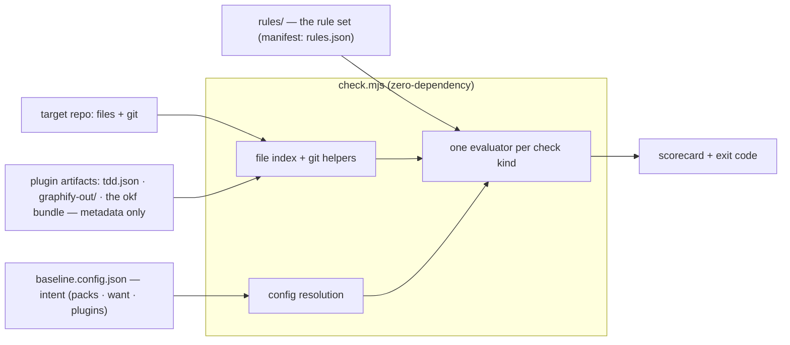
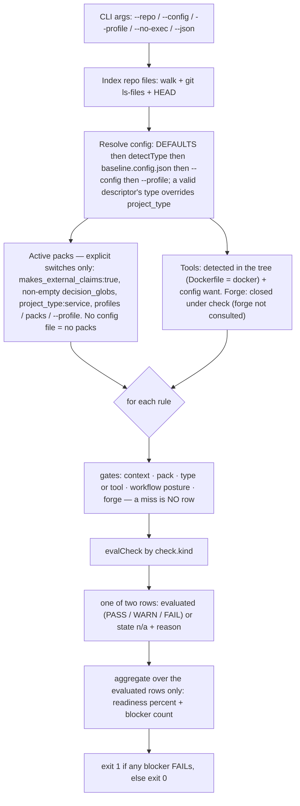
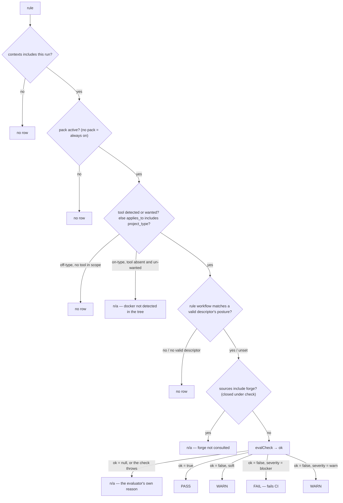

# project-baseline v3 — reference

A **testable readiness standard**. Every lesson is a rule; a zero-dependency runner scores a repo at rest and **fails CI on the always-on blockers**. Everything else warns, and what a machine cannot check is not a rule — v3 deleted the manual, sign-off-backed rules rather than keep a written promise in the rule set.

> The throughline: *don't trust a written promise — make something check it.* A checklist doc would just become another thing that drifts. This is the checklist as an exit code.

> **New to the jargon?** Terms like [SBOM](GLOSSARY.md#sbom), [SLSA](GLOSSARY.md#slsa), [provenance](GLOSSARY.md#provenance), [pack](GLOSSARY.md#pack) and [plugin](GLOSSARY.md#plugin) are defined in the [glossary](GLOSSARY.md).

**v1** distilled its rules from three of the author's own repos. That sample was thin. **v2** pressure-tested them against the field's actual prior art — [OpenSSF Scorecard](GLOSSARY.md#openssf-scorecard), [SLSA](GLOSSARY.md#slsa), the [Twelve-Factor App](GLOSSARY.md#twelve-factor-app), Google's SRE books, [Diátaxis](GLOSSARY.md#diataxis), [Keep a Changelog](GLOSSARY.md#keep-a-changelog), [repolinter](GLOSSARY.md#repolinter), [Backstage/Cortex/OpsLevel](GLOSSARY.md#service-catalog), Stryker, and ~40 more sources — each candidate **adversarially verified** (is the source real? is it robot-checkable at rest? does it add anything?) before it earned a place. **v3** turned the enforcer back into scaffolding: the lane workflow, the divergence rules, the records ledger's history checks and the vendored-lock check are gone, opt-in packs run only from an explicit switch, and three plugins are *suggested* — never required.

**How big is it?** Not stated here — a count in prose is the drift this repo exists to catch. `node check.mjs --self-check` derives the rule count, the always-on blockers, the pack sizes and the per-type coverage on every run; the [rule table](#the-rules) below is regenerated from the same source.

## The four-part shape (v3)

baseline is one part of four. It owns **verdicts** — deterministic, offline, one exit code. The rest is plugins, reached through file contracts only:

| piece | owns | reaches baseline via |
|---|---|---|
| **baseline** | verdicts | — |
| **obsidian-tdd** | what is open (red/green tests) | `tdd.json`, committed |
| **graphify** | what is where (code structure) | `graphify-out/`, local, gitignored |
| **okf-rag** | why things matter (prose, rationale) | a bundle at `$BASELINE_OKF_BUNDLE`; `get_knowledge()` for agents |

baseline imports no code from any of them and runs to a complete verdict with all three absent. See [Plugins](#plugins--suggested-never-required).

## Packs — the run contains only what you switched on

Not every rule fits every repo. A pre-code planning repo shouldn't be nagged about health endpoints; a CLI shouldn't be told to publish an [SBOM](GLOSSARY.md#sbom). So a rule may carry a **`pack`** — one of the `packs` map in `rules.json`; a rule with no pack is **always on**. **With no config file every pack is off.** A pack turns on only from an explicit switch in `baseline.config.json` (or `--config`): nothing in the tree — a claims register, a `services/` directory, the descriptor's declared `type` — activates one, the defaults never do, and activating one pack activates no other.

| pack | explicit switch |
|---|---|
| `claims` | `makes_external_claims: true` — set explicitly (the default is `false`; a register in the tree is not a switch, and there is no maturity gate) |
| `decisions` | `decision_globs` — set explicitly and non-empty (the DEFAULTS globs are what the rules *read* once on; they never activate it) |
| `service` | `project_type: "service"` — set explicitly in config; never auto-detection, never the descriptor's `type` |
| `descriptor` | the list below only |
| `advanced` | the list below only — expert/niche rules ([SBOM](GLOSSARY.md#sbom), [code-scanning](GLOSSARY.md#sast), [mutation testing](GLOSSARY.md#mutation-testing), symbol-integrity) that would be noise on most repos |

Any pack, by name: `profiles: ["advanced"]` in config (alias `packs`), or `--profile <pack>` on the CLI — the flag keeps its v2 spelling and means *pack*. The run header (`packs=[…]`) and the `--json` `packs` list say what was active; the rule table's **Pack** column says which rules each switch brings in, and `--self-check`'s coverage matrix counts them.

A rule in an inactive pack is **not part of the run** — it produces no row and counts nothing, so the standard can carry every rule without any single repo hearing about more than it opted into. What a rule *does* produce is fixed by the two-row contract in the architecture section: an evaluated row, or `state: "n/a"` with a reason.

## Project types, `applies_to`, and `tool`

A pack decides *whether you asked for* a rule; **`applies_to`** decides *what kind of repo* it fits. Every rule declares one, checked against a closed set of project types:

`node` · `python` · `service` · `library` · `docs`

- `applies_to: "all"` — universal (secrets, LICENSE, broken links, doc drift, plugins…).
- `applies_to: ["node","python","service","library"]` — **code repos only** (build/test/lint/reproducibility rules); on a `docs` repo they produce no row.
- `applies_to: ["service"]` — long-running **services only** (the OPS rules, which also sit in the `service` pack).

`project_type` auto-detects (`package.json` ⇒ `node`/`service`, `pyproject.toml` ⇒ `python`, else `docs`) and can be pinned in `baseline.config.json` — or **declared in `baseline.repo.json`**, whose `type` supersedes auto-detection (a tooling `package.json` no longer misclassifies a docs repo as `node`). The descriptor's type governs `applies_to` only; it never switches the `service` pack on. A rule whose `applies_to` doesn't include your type is not part of the run — no row.

**`tool`** — a rule may name the tool whose artifact it reads (the closed vocabulary is `TOOLS` in `src/selfcheck.mjs`; today `docker`, declared by REPRO-04). Such a rule is in scope when the tool is **detected in the tree** (a `Dockerfile` ⇒ `docker`) **or** config **`want`** names it — and `want` overrides both the tool gate and the `applies_to` type gate, so `want: ["docker"]` runs REPRO-04 on a docs-only repo (with no Dockerfile there it returns a real WARN, never n/a: intent counts as presence). An on-type rule whose tool is absent and un-wanted is an **n/a row** with the reason `docker not detected in the tree (declare want:["docker"] to evaluate anyway)` — explicit in `--json`, hidden from the human render. A `want` entry naming no known tool is printed by name on stderr. The vocabulary grows only with a rule that declares the new value.

**Integrity gate — so a scope can't silently dangle.** A mistyped scope (`"nodejs"`, `"doc"`) or pack would make a rule quietly never run. The rule set validates itself:

```bash
node check.mjs --self-check
```

It exits 1 on any rule missing `applies_to`, or naming an unknown type / pack / tool / check kind / severity / category, a two-part id (v3 ids are `PREFIX-NN-slug`), a duplicate id or slug, a retired v2 `profile` or `requires` key, an orphan type / pack / tool, a claims-category rule outside the `claims` pack, or a `dockerfile-digest` check without `tool: "docker"` — and prints the **coverage matrix** (how many rules apply to each type, always-on vs each pack) and the tool vocabulary. Wire it into CI so a malformed rule set can't merge.

## Why it's shaped this way

Three failure layers showed up across the original repos, and the drift **climbs** as a project matures:
- **Code / tests / CI** — broken in the pre-code repos (no scaffolding, Task 1 couldn't run), solid in the mature one.
- **Narrative docs** — became the mature repo's #1 risk (stale resume marker, un-superseded ADR).
- **Headline claims** — falsified in the pre-code repos by shipping prior art.

v1 covered those three layers. v2 added the layers a *shipping* repo lives or dies on — **security & supply-chain, reproducibility, operability, code-quality gates, change governance** — plus deeper **context/doc-drift** checks (dead links, doc freshness, generated-file provenance). v3 kept the bias and dropped the enforcement of a workflow that no longer exists: everything a machine can verify, biased toward blocking only the things that are unambiguous.

## Architecture & data flow

These diagrams mirror the runner — they're its actual control flow, not a sketch. The whole thing is zero-dependency Node (`check.mjs` as the thin CLI over `src/`: repo index · config · evaluators · engine · report): it indexes the repo, resolves config, then walks every rule through the same gate → evaluate → tag pipeline.

**The components.** Three inputs (your config, the rule set, the target repo) feed one engine. Plugin artifacts enter as **metadata only** — exists, file or directory, mtime, gitignore state — never as content.


```mermaid
flowchart LR
  CFG["baseline.config.json — intent (packs · want · plugins)"] --> RES
  RULES["rules/ — the rule set (manifest: rules.json)"] --> EVAL
  REPO["target repo: files + git"] --> IDX
  PLUG["plugin artifacts: tdd.json · graphify-out/ · the okf bundle — metadata only"] --> IDX
  subgraph ENGINE["check.mjs (zero-dependency)"]
    IDX["file index + git helpers"] --> EVAL["one evaluator per check kind"]
    RES["config resolution"] --> EVAL
  end
  EVAL --> OUT["scorecard + exit code"]
```

**The run.** One pass: build the file index and git state, resolve config (defaults → auto-detected `project_type` → `baseline.config.json` → `--config` → `--profile`, then a valid descriptor's `type`), derive the active packs from the explicit switches alone, detect tools, close the forge for this run, then walk every rule through the gates and reduce the evaluated rows to a readiness % and an [exit code](GLOSSARY.md#exit-code).


```mermaid
flowchart TD
  A["CLI args: --repo / --config / --profile / --no-exec / --json"] --> B["Index repo files: walk + git ls-files + HEAD"]
  B --> C["Resolve config: DEFAULTS then detectType then baseline.config.json then --config then --profile; a valid descriptor's type overrides project_type"]
  C --> D["Active packs — explicit switches only: makes_external_claims:true, non-empty decision_globs, project_type:service, profiles / packs / --profile. No config file = no packs"]
  C --> E["Tools: detected in the tree (Dockerfile = docker) + config want. Forge: closed under check (forge not consulted)"]
  D --> F{"for each rule"}
  E --> F
  F --> G["gates: context · pack · type or tool · workflow posture · forge — a miss is NO row"]
  G --> H["evalCheck by check.kind"]
  H --> I["one of two rows: evaluated (PASS / WARN / FAIL) or state n/a + reason"]
  I --> J["aggregate over the evaluated rows only: readiness percent + blocker count"]
  J --> K["exit 1 if any blocker FAILs, else exit 0"]
```

**Per-rule gates → one of two rows.** Every rule runs the same funnel, and it ends in exactly one of two shapes. A **gate miss** — outside this context, inactive pack, off-type without a tool in scope, workflow posture off — means the rule is **not part of the run: no row at all**. A rule that is **in scope but not evaluable here** — no subject in the tree, the forge closed, an evaluator returning `ok: null` or throwing — is an **n/a row**: `{ "id", "state": "n/a", "reason" }` in `--json` (no tag; the reason is never empty), hidden entirely from the human render (no skip line, no n/a tally), and outside `summary.total`, which counts evaluated rows only. There is no `SKIP` tag anywhere. Only a `blocker` that evaluates to `false` fails CI.


```mermaid
flowchart TD
  R["rule"] --> CX{"contexts includes this run?"}
  CX -- "no" --> N0["no row"]
  CX -- "yes" --> P{"pack active? (no pack = always on)"}
  P -- "no" --> N1["no row"]
  P -- "yes" --> T{"tool detected or wanted? else applies_to includes project_type?"}
  T -- "off-type, no tool in scope" --> N2["no row"]
  T -- "on-type, tool absent and un-wanted" --> NA1["n/a — docker not detected in the tree"]
  T -- "yes" --> WF{"rule workflow matches a valid descriptor's posture?"}
  WF -- "no / no valid descriptor" --> N3["no row"]
  WF -- "yes / unset" --> FG{"sources include forge? (closed under check)"}
  FG -- "yes" --> NA2["n/a — forge not consulted"]
  FG -- "no" --> E["evalCheck → ok"]
  E -- "ok = null, or the check throws" --> NA3["n/a — the evaluator's own reason"]
  E -- "ok = true" --> PASS["PASS"]
  E -- "ok = false, soft" --> W1["WARN"]
  E -- "ok = false, severity = blocker" --> F["FAIL — fails CI"]
  E -- "ok = false, severity = warn" --> W2["WARN"]
```

**The `--json` shape.** `results[]` carries every row in both shapes; `summary` is `{ blockers, pass, warn, fail, diverged, total }` where **`total` is the number of evaluated rows** (n/a rows are in `results` but in no count); `packs` is the active list (`profiles` mirrors it under the config key's spelling); `provenance: { knowledge: "not-consulted" }` records that `check` never read the knowledge bundle (that is `explain`'s plane). A PLUG WARN row also carries `log`, the path of the file it wrote.

```json
{ "id": "REPRO-04-docker-base-pinned-by-digest", "state": "n/a", "reason": "docker not detected in the tree (declare want:[\"docker\"] to evaluate anyway)" }
{ "id": "SEC-01-no-committed-secrets", "tag": "PASS", "detail": "pattern not found (good)" }
```

## Quickstart
```bash
# 1. drop the toolkit in (e.g. tools/baseline/) — or ./install.sh for an agent skill dir
cp -r baseline-skill tools/baseline

# 2. declare intent (copy + edit) — packs, want, plugins, bootstrap_command
cp tools/baseline/config.example.json baseline.config.json

# 3. run it
node tools/baseline/check.mjs                      # human-readable scorecard, exit 1 on blockers
node tools/baseline/check.mjs --json               # machine output for CI
node tools/baseline/check.mjs --no-exec            # skip the clean-checkout command (BUILD-05)
node tools/baseline/check.mjs --profile advanced   # activate a pack by name (--profile <pack> means pack)
```
No install, no dependencies — needs only Node ≥ 18 and `git`.

## Wire it into CI (the point)
```yaml
  baseline:
    runs-on: ubuntu-latest
    steps:
      - uses: actions/checkout@<sha>
      - uses: actions/setup-node@<sha>
        with: { node-version: 22 }
      - run: node tools/baseline/check.mjs      # drop --no-exec so BUILD-05 runs the real Task 1
```
Make `baseline` a required status check. Now the standard can't rot — it's enforced on every PR. (That's rule **BUILD-06**, checking itself.)

## The verbs

`baseline.mjs` is the entry point; `check` is the default and delegates to `check.mjs`.

| verb | what it does |
|---|---|
| `check [--repo DIR] [--json] [--no-exec] [--profile <pack>]` | score a repo — the scorecard above; exit 1 only on an always-on (or active-pack) blocker |
| `check --self-check` | validate the rule set and print the derived counts and coverage matrix |
| `orient [--repo DIR] [--json]` | the session-start survey: five lines (`repo:` · `work:` · `graph:` · `knowledge:` · `score:`), derived from the tree and plugin metadata. Read-only toward the repo, no forge, never a gate — exit 0 whatever it finds. `--json` carries `graph: { state, mtime }` and a `suggestions[]` list (an absent graph is a suggestion, never a finding) |
| `explain <rule-id> [--json]` | what a rule checks and why: its title and rationale from the rule set, plus the concept at `$BASELINE_OKF_BUNDLE/baseline/rules/<id lowercase>.md` when a bundle is configured — **display only, never a verdict**. Resolves the full id or the two-part prefix (`SEC-01`); degrades to the title with the bundle absent, exit 0 |
| `explain --audit [--json]` | every rule id resolves to a concept **file** in the bundle — by filename, no concept is opened; exit 1 on a hole |
| `gen okf-concepts [--repo DIR]` | the one-shot OKF migration: a **deterministic extraction** — one markdown concept per rule (YAML frontmatter naming the `REFERENCE.md` row or `rules/<module>.json#<id>` it came from, glossary terms cited by line) staged under `<repo>/.baseline/proposed/baseline/rules/` and nowhere else. The bundle is never read or written; the maintainer reviews the batch and copies it in by hand. There is no `--propose` |
| `gen index` / `gen --check` / `gen migrate-claims` | the generated index view and its CI drift guard; the claims-monolith migration — see [Generated views](#generated-views--gen-index--gen---check) |
| `admit`, `reconcile`, `log`, `jdg`, `scrub` | the records-and-merge verbs kept from v2 — [Records](#records--the-write-gate). They are outside the always-on gate |

## Plugins — suggested, never required

baseline is workflow scaffolding, and the plugins ship as **suggestions**: offered to every repo, gating none of them until the repo adopts one. Install is per approval — baseline prints the install command and never runs it.

**The boundary is metadata.** For a plugin artifact baseline may read: does the path exist, is it a file or a directory, its mtime, and its gitignore state. It never opens the artifact — no `covers[]` out of `tdd.json`, no `Built from commit:` out of `GRAPH_REPORT.md`, no concept body during `check`. `explain` may *display* a concept from the OKF bundle; display is not a verdict.

**One rule per plugin — the `PLUG` family.** Each plugin is exactly one rule, category `plugins`, severity `blocker`, kind `plugin-presence`, in `rules/plug.json`:

| rule | plugin | default artifact | default gitignore state |
|---|---|---|---|
| `PLUG-01` | obsidian-tdd | `tdd.json` (file) | tracked |
| `PLUG-02` | graphify | `graphify-out/` (directory) | ignored |
| `PLUG-03` | okf-rag | the bundle at `$BASELINE_OKF_BUNDLE` (directory) | ignored; the question is skipped when the path is outside the repo |

**Membership decides whether the rule gates.** The table above is what baseline *supports*; the trust circle is what a repo *adopted*, and adoption is a fact about the config, never a guess about the tree:

| standing | how it is stated | verdict |
|---|---|---|
| **member** | the plugin's **name is a key** of `baseline.config.json` `plugins` | the rule gates: artifact absent → **FAIL naming the install command**; present but the gitignore state differs from config → **FAIL naming the mismatch** (the config value and git's answer); otherwise **PASS**. A FAIL exits 1 |
| **suggested** | the key is absent — the shipped default, untouched | **`n/a`**, excluded from the exit gate, no log. baseline offers the tool in the report and in `baseline trust setup`; it can never fail a build |
| **declined** | the key is present with `false` or `null` | `n/a`, exactly like suggested — the decision is simply on the record |

So *absent and not a member* is `n/a`; *member and missing* is a blocker. That is the enabler property: a repo that adopted nothing scores green on the plugin family, and one that adopted a tool gets the gate it asked for. A plugin never produces a second row. The finding is a `check` row (CI sees it), not an `orient` line.

Key presence is what makes membership a fact rather than a guess: `{"graphify": {}}` adopts at the shipped defaults and is indistinguishable *in value* from a repo that wrote nothing — but not *in key*. `$BASELINE_OKF_BUNDLE` sets a member's path and never creates membership, because CI clones tracked files and not a shell.

**The only git question baseline asks about a member is "tracked or ignored, per the user's setup".** Config key **`plugins`**, keyed by plugin name, one entry per adopted plugin — `{ "path": <relative path>, "ignored": true|false }` — with the defaults above; `ignored: false` means *tracked*:

```json
{ "plugins": { "graphify": { "path": "graphify-out", "ignored": true }, "obsidian-tdd": {} } }
```

**Joining and leaving.** `baseline trust add <tool>` writes the key (`--path`, `--ignored` to override the defaults); `baseline trust remove <tool>` deletes it and the tool goes back to being a suggestion. `baseline trust setup [--repo DIR]` prints every supported tool, whether this repo adopted it, and — when nothing is adopted — the recommended `plugins` block to copy. `check` names the circle on a `Trust circle` line and in `--json` under `trust: { members, suggested }`.

### The baseline rules layer — the other opt-in, and the only one that is IN by default

Membership above is the opt-**in** half of the rule set. Every rule that is *not* a plugin rule — `BUILD-03`, `BUILD-04`, `GOV-03`, `SEC-01`, `SEC-02`: the tree reads any repo can answer — is one **layer**, opted in or out **at setup time**, and its default is **in**. The asymmetry is the product: adopting a tool is a choice a repo makes, whereas the baseline is what you get by standing still.

Config key **`baseline_rules`**, and it follows membership's discipline — the fact is read off the config text, never guessed from the tree. What differs is which way the *absence* points:

| value | layer | meaning |
|---|---|---|
| key absent | **in** | the default. Those rules gate, exactly as they did before the layer existed |
| `true` | **in** | the same run, said out loud |
| `false` | **out** | every baseline rule resolves **`n/a`** — no finding, no exit code — the same treatment an unadopted plugin gets |
| anything else | **in** | only the literal `false` opts out: **in** is the safe direction, so no typo can quietly stop a rule from gating |

**It is never silent.** `check` prints a `Baseline layer` line on every run — in *and* out, naming every muted rule when it is out — and `--json` carries `baseline: { layer, source, key, rules }` beside `trust`. An opt-out is a decision on the record, not a hiding place.

**The layer does not reach the trust circle.** A member's `PLUG` rule keeps gating with the layer out; one key can never mute the whole rule set.

**Choosing.** `baseline trust setup --baseline-rules in|out` is what writes it: `out` writes `"baseline_rules": false`, and `in` **deletes** the key, because an absent key *is* in. Plain `baseline trust setup` prints the layer's state, the rules it governs, and changes nothing.

**Every finding leaves a log.** A `PLUG` finding row prints the path **`.baseline/log/<PREFIX-NN>.log`** (`.baseline/log/PLUG-02.log`); the file records the paths inspected, the config values used, and the gitignore answer, so the finding can be investigated without re-running. It is overwritten each run and removed when the row returns to PASS. `--json` carries the same path as `log`. `.baseline/log/` joins `.baseline/cache/` in the gitignore template.

**The forge is closed under `check` and `orient`.** `GOV-01`, `GOV-02` and `OPS-07` are forge-sourced and survive; under `check` and `orient` they resolve `n/a` with the reason `forge not consulted`, before their evaluator runs, so neither verb ever spawns `gh`. `admit` and `reconcile` keep the live probe.

## Generated views — `gen index` + `gen --check`

A **generated view** is a tracked markdown file whose first line is the marker `<!-- baseline:generated <kind> — do not edit by hand; regenerate: baseline gen <kind> -->` — static bytes, no hash, no timestamp, no version. One kind ships:

```
baseline gen index [--repo DIR] [--out PATH]     # write the view (default docs/INDEX.md)
baseline gen --check [--repo DIR]                # regenerate every marked view, byte-compare (CI drift guard)
baseline gen migrate-claims [--repo DIR]         # explode a legacy docs/CLAIMS.json into records/claims/CLM-NNNN.json
baseline gen okf-concepts [--repo DIR]           # stage one proposed okf concept per rule under .baseline/proposed/ (never the bundle)
```

`gen index` derives a **deterministic** index — the judgments/claims ledgers, session-record counts (newest date from the *filename*, the tool's one recency truth; pool = tracked ∪ walked, so the record `baseline log` just wrote rides the same regeneration) and a docs map (first-heading titles, filename fallback; generated views excluded) — everything sorted, links **relative to the out file's directory** (CTX-05 resolves a doc's links against its own dir). It writes over its own marker or into absence and **refuses a file without the marker** (move it aside or pass a different `--out` — never paste the marker onto a hand-written file).

`gen --check` discovers marked views over the tracked ∪ walked pool with **uncapped reads**, regenerates each in memory, and byte-compares. Zero marked views → exit 0, trivially green — the pre-adoption state. Drift → exit 1 with a **verbatim-runnable remedy** derived from the invocation itself (a vendored consumer has no `baseline` on PATH), plus the honesty clauses: the drift may predate your PR, and a vendor bump changes the generator's shape — regenerate with the new version and commit the view alongside it. Wire it as an **advisory CI job — visibly red, outside the required set, never `continue-on-error: true`**.

**Vendoring a copy** (`tools/baseline/`) is plain `cp -r` and a same-PR bump when you update it; v3 keeps no lock file and no rule about the vendored tree's freshness — reading a commit out of an artifact is the plugin-data parse the metadata boundary forbids.

## Configuration

Everything auto-detects; override only what you need in `baseline.config.json` (see `config.example.json`). The keys that matter:

| key | what it does |
|---|---|
| `project_type` | `node`\|`service`\|`python`\|`library`\|`docs`. Set **explicitly** to `service` it activates the `service` pack (the OPS rules); auto-detection and the descriptor's `type` never do. |
| `profiles` (alias `packs`) | packs to activate by name, e.g. `["advanced"]`; `--profile <pack>` is the CLI form. With no config every pack is off. |
| `want` | tools declared present-by-intent, e.g. `["docker"]` — puts the tool's rules in scope even on a repo where the artifact (or the type) is missing; an unknown name is reported on stderr. |
| `baseline_rules` | the **baseline rules layer**: `false` opts every non-plugin rule out (they resolve `n/a`, out of the exit gate); absent or `true` leaves the layer **in**, which is the default. Written by `baseline trust setup --baseline-rules in\|out`; the state is printed on every `check`. |
| `plugins` | per-plugin `{ path, ignored }`, keyed `obsidian-tdd` \| `graphify` \| `okf-rag` — where the artifact lives and whether git is expected to ignore it (`ignored: false` = tracked). Defaults: `tdd.json` tracked, `graphify-out/` ignored, the okf bundle ignored. The PLUG rules read nothing else. |
| `makes_external_claims` | `true`, set explicitly, activates the `claims` pack (all CLAIM-* rules); the default `false` leaves them out of the run. |
| `bootstrap_command` | the clean-checkout Task-1 command (BUILD-05); must exit 0. Unset softens BUILD-05 to WARN (unconfigured ≠ failing). |
| `freshness_globs` | **opt-in** for CTX-06 — docs that must carry a `last_review_date`. Empty = the rule resolves n/a. |
| `generated_globs` | **opt-in** for CTX-08 — generated files that must carry a `DO NOT EDIT` marker. Empty = n/a. |
| `grounding_docs` | **opt-in** for CTX-09 — required docs that must exist + be non-empty. Empty = n/a. |
| `decision_globs` / `doc_globs` | where decision-record and link/path checks look. `decision_globs` set explicitly and non-empty activates the `decisions` pack — the default globs never do. |
| `doc_lag_days` | CTX-11 warns when a doc's anchored `sources:` code was committed more than this many days after the doc (default 30). |

The three opt-in `*_globs` keys default to empty, so those rules resolve n/a (state `n/a` in `--json`, hidden from the human render) until you adopt the convention — no nagging a repo that hasn't opted in.

## Records & the write gate

The stored surface the checker can't derive is the **records** — one unit per file, schema-bound:

| kind | home | schema |
|---|---|---|
| session | `records/sessions/<branch>/<YYYY-MM-DD>-<HHMMSS>-<agent>.md` | `schema/record.session.schema.json` |
| judgment | `records/judgments/JDG-NNNN.json` (deviation · risk-acceptance · break-glass) | `schema/record.judgment.schema.json` |
| claim | `records/claims/CLM-NNNN.json` | `schema/record.claim.schema.json` |
| decision | `records/decisions/ADR-NNNN.md` (header fields) | `schema/record.adr.schema.json` |

Write sessions with the CLI — one command, nothing to remember:

```bash
node baseline.mjs log -m "what happened and why" --next "the one most useful next step"
# branch, agent and timestamp derived · stdin accepted · never $EDITOR
```

Every write passes the **scrub gate** (`src/scrub.mjs`, one `scan()` shared by every layer): deterministic signatures (SEC-01 parity + JWT + fine-grained PAT) **block**; assignment/entropy heuristics **warn** (severity never exceeds certainty). A block is non-lossy — the draft survives under `.baseline/cache/` and the exact rerun is printed; a false positive becomes a dated judgment via `--allow <finding-id> --allow-reason "..."` in `.baseline/scrub-allowlist.json` (one flag surface across `log` and `jdg`; the finding id is a content-derived hash — the value itself is never stored). Filenames are collision-free by construction: no counters, `O_EXCL`, same-second-same-agent refuses loudly.

**The judgment ledger.** A judgment is dated, owned, scoped, reasoned — and it **expires**: `expected_state` snapshots the world it assumed (mismatch = **DRIFTED**), `tripwire` (`fact op value`; ops `eq|ne|gt|lt|exists|absent`) voids it (**TRIPPED**), `review_by` lapses it (**EXPIRED**); an unknown fact path is **UNRESOLVABLE** — surfaced, never guessed. `baseline jdg new --kind <deviation|risk-acceptance|break-glass> --subject <scope> --reason "..." --review-by <date>` writes one; `baseline jdg check` evaluates the ledger (exit 1 on tripped/expired/invalid). No rule is satisfied by a judgment: v3 deleted the manual rules, so a judgment records a decision — it never stands in for a check. The hand-written forms live in **[CONTRACT.md](CONTRACT.md)**.

**What the rules verify on what landed.** **REC-02** re-scans landed records with the same `scan()` — blob content at HEAD, *what landed*, never the worktree — and fires on a deterministic finding anywhere you commit (heuristics stay soft); **REC-05** wants a push-time secret gate visible **at rest**: it PASSes on gitleaks-class wiring (CI, pre-commit, or a config) or a committed `scrub-pre-push` hook script (GitHub push protection satisfies the same intent but isn't observable at rest, so on its own REC-05 still warns). Hand-written records get the scrub at the push boundary once the shipped hook is installed per clone (`cp tools/baseline/hooks/scrub-pre-push.sh .git/hooks/pre-push`), whose engine is `baseline scrub` (worktree files, or `--pushed SHA [--since SHA]` committed-blob ranges).

**Claims explosion.** `baseline gen migrate-claims` explodes a legacy `docs/CLAIMS.json` monolith into per-claim `records/claims/CLM-NNNN.json` — `slug` preserves the old id, numbering continues past existing records, schema-invalid claims are refused loudly, reruns are idempotent. The CLAIM checks read **records only** — an unmigrated monolith is never counted; **CLAIM-07** warns while it lingers. The CLAIM rules run only when the `claims` pack is switched on. The stored-status surface is retired outright: CTX-12 blocks the line-anchored stamp signature in any tracked doc — `orient` is the status surface, everywhere.

**Admit and reconcile** (kept from v2, outside the always-on gate). `baseline admit` re-derives at the merge point and refuses (exit 1) on staleness — the target tip is not an ancestor of HEAD — on an admit-context blocker (DESC-03, in the `descriptor` pack), or on gating-source loss; the target ref's descriptor governs the run. `baseline reconcile` revalidates the default branch on cron and files what it finds as dedup'd, lifecycle-managed `baseline`-labeled issues — the tracker is its only write surface; exit 1 means delivery failed, never "findings exist". Both keep the live forge probe that `check` and `orient` do not have. Every admit verdict carries a `provenance: inputs_digest …` receipt naming exactly what it was derived from.

## The rules

[`blocker`](GLOSSARY.md#blocker) fails CI · [`warn`](GLOSSARY.md#warn) is advisory. There is no third severity: a rule a script can't check is not in the rule set.

Every rule also declares **`sources`** (which ground-truth planes it reads: tree · history · forge · exec), **`on_unreachable`** (skip · fail · stale-ok), **`contexts`** (check · admit · reconcile), and **`certainty`** (deterministic · heuristic). `--self-check` enforces the structural law that a **blocker must be deterministic**, and the pack laws above (a rule's `pack` is data drawn from the `rules.json` `packs` map; the v2 `profile`/`requires` keys are rejected).

Ids carry three parts — `PREFIX-NN-semantic-slug` (`SEC-01-no-committed-secrets`, `BUILD-05-task-1-passes-clean`, `CTX-12-status-is-derived`): the id says what the rule checks, so a finding is readable with no lookup, and the two-part prefix of every surviving rule is unchanged from v2, so a v2 id (`SEC-01`) still resolves in `explain` and in the okf bundle.

**The table below is generated** — `node docs/assets/gen-reference-rules.mjs` rewrites it from `loadRules()` (and `--check` fails CI when it is behind the rule set). Rerun it whenever `rules/` changes; a new family lands here by running it once. *Pack column:* `—` = always on (no pack); a pack name = runs only when that pack is switched on. *Scope:* `applies_to`, plus the `tool` the rule declares.

<!-- baseline:rules-table begin — generated by docs/assets/gen-reference-rules.mjs; edit rules/*.json (or the glosses in that script), then rerun it -->

### Build & execution

| ID | Rule | Severity | Pack | Scope |
|---|---|---|---|---|
| BUILD-03-ci-workflow-present | CI workflow present | 🔴 blocker | — | node, python, service, library |
| BUILD-04-env-template-present | Env/secret template present | 🔴 blocker | — | node, python, service |

### Security & supply-chain

| ID | Rule | Severity | Pack | Scope |
|---|---|---|---|---|
| SEC-01-no-committed-secrets | No high-signal secrets committed | 🔴 blocker | — | all |
| SEC-02-env-files-ignored | Real .env files are git-ignored, not committed | 🔴 blocker | — | all |

### Change governance

| ID | Rule | Severity | Pack | Scope |
|---|---|---|---|---|
| GOV-03-codeowners-names-owner | CODEOWNERS exists and names an owner | 🔴 blocker | — | all |

### Plugins

| ID | Rule | Severity | Pack | Scope |
|---|---|---|---|---|
| PLUG-01-obsidian-tdd | obsidian-tdd artifact present and tracked | 🔴 blocker | — | all |
| PLUG-02-graphify | graphify graph present and gitignored | 🔴 blocker | — | all |
| PLUG-03-okf-rag | okf-rag bundle present | 🔴 blocker | — | all |

<!-- baseline:rules-table end -->

### Notes by family

- **Change governance.** GOV-01/02 are **live asserts on the forge's readable surface** (`forge-protection`): `GET /repos/:nwo/rules/branches/:b` first, the branch `protected` flag second, the classic `/protection` endpoint only under the explicit `BASELINE_GOV_ADMIN=1` opt-in. Under `check` and `orient` the forge is closed — both resolve n/a (`forge not consulted`) before the evaluator runs, so no `gh` is spawned. `admit` and `reconcile` keep the live probe; there a token-scoped denial is n/a ("protection unreadable with this token"), never a finding — a committed ruleset *file* proves nothing about enforcement, so there is no file grep.
- **Claims discipline.** All CLAIM rules sit in the `claims` pack: they run only when `makes_external_claims: true` is set explicitly (or the pack is named in `profiles`/`packs`/`--profile`). A register present in the tree is not a switch — an unset switch means no row.
- **Records & ledger.** REC-02 and REC-05 target **anything you commit**, not only `records/` — a secret committed outside `records/` fires both. They resolve n/a when nothing is committed to scan.
- **Repo descriptor** (`descriptor` pack). A schema-validated `baseline.repo.json` (`type`, `lifecycle`, `maturity`, `workflow`, `anchoring`) is a declared identity, not a guess: absent → DESC-01 warn + scaffold; present-but-invalid → DESC-02 blocker; a change to it without a same-range judgment whose `subject` is exactly `baseline.repo.json` → DESC-03 refuses admission (admit context only). A valid descriptor's `type` supersedes filesystem auto-detection and never activates a pack.
- **Plugins** (`PLUG` family, always on). One WARN per absent or mis-ignored plugin artifact, never a FAIL; every WARN leaves `.baseline/log/<PREFIX-NN>.log`. See [Plugins](#plugins--suggested-never-required).
- **Operability** (`service` pack). OPS-07 asks the forge ONE workflow-state question about the reconcile cron and is therefore n/a under `check`; the other OPS rules read the tree.

## Check kinds (how the runner verifies, with zero deps)

Every check kind is one evaluator in `src/evaluators.mjs`, registered in `CHECK_KINDS`; `--self-check` rejects a rule naming a kind that is not registered, and the registry, the kinds rules use as their own check, and the kinds used anywhere (inside `any-of` / `implies`) are the same set — so "how many kinds" has one answer, printed by the tool. **The list below is generated** from the registry by the same script as the rule table.

<!-- baseline:check-kinds begin — generated by docs/assets/gen-reference-rules.mjs; edit rules/*.json (or the glosses in that script), then rerun it -->

- `any-file` — glob presence (`mode: absent`, `tracked_only`, `allow`)
- `doc-code-age` — a doc does not lag the code it anchors by more than `doc_lag_days`
- `file-contains` — the file exists AND matches
- `grep` — regex present / absent / all over file contents (`tracked_only`)
- `plugin-presence` — a plugin artifact exists and its gitignore state matches the `plugins` config — metadata only, never the content

<!-- baseline:check-kinds end -->

A rule with a check the runner can't evaluate (bad regex, missing target, a thrown evaluator) resolves to **`state: "n/a"`** with the error as its reason, never a crash — one broken rule can't take down the run.

## What changed, by major version

- **v1 → v2.** The original build/test/context/claims rules kept verbatim; the security/supply-chain block (secrets, `.env` hygiene, action-pinning, dep-updates, binaries, security policy), code-quality gates (linter/formatter/strict-types), reproducibility (frozen installs, runtime pinning + a cross-file drift check), onboarding basics (LICENSE, README, CHANGELOG, bootstrap entrypoint), change governance, deeper context checks (broken links, doc freshness, generated-provenance, grounding docs, resolvable ADR links), acceptance-criteria presence, and the records ledger.
- **v2 → v3.** Three-part ids. The lane-workflow, divergence and merge-admission families, the records' append-only/one-home history checks, the vendored-lock check and every manual (sign-off) rule deleted — with their machinery. Packs activate from explicit switches only. `tool` / `want` scope the run to what the repo uses; `n/a` is a state, not a row a human sees. The forge closed under `check` and `orient`. The three `PLUG` rules and the `plugins` config key. `explain` and `gen okf-concepts` as the one read seam and the one (staged, human-approved) write toward the knowledge bundle. `orient` shrunk to five lines; `SKILL.md` to a page; every count derived. Historical detail: `CHANGELOG.md`, `docs/v3/PLAN.md`.
