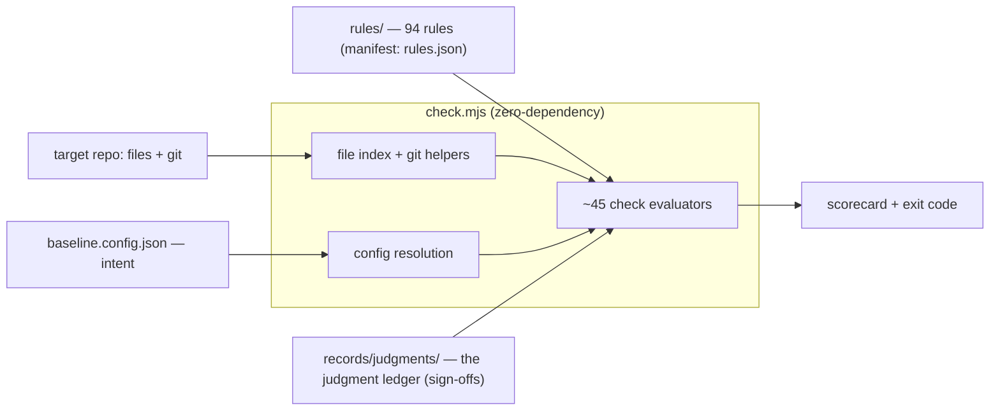
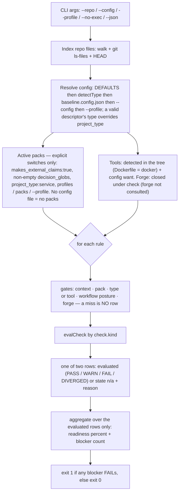
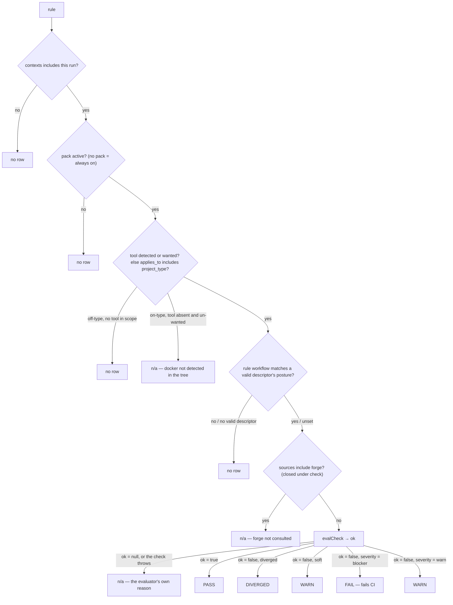

# project-baseline v2 (2.5)

A **testable readiness standard** for new projects. Every lesson is a rule; a zero-dependency runner scores a repo and **fails CI on the blockers**. The judgment calls a script can't make become a dated **[sign-off ledger](GLOSSARY.md#sign-off-ledger)** — so even those leave a checkable trace.

> The throughline: *don't trust a written promise — make something check it.* A checklist doc would just become another thing that drifts. This is the checklist as an exit code.

> **New to the jargon?** Terms like [SBOM](GLOSSARY.md#sbom), [SLSA](GLOSSARY.md#slsa), [provenance](GLOSSARY.md#provenance), and [sign-off ledger](GLOSSARY.md#sign-off-ledger) are defined in the [glossary](GLOSSARY.md).

**v1** distilled 20 rules from three of the author's own repos. That sample was thin. **v2** pressure-tested v1 against the field's actual prior art — [OpenSSF Scorecard](GLOSSARY.md#openssf-scorecard), [SLSA](GLOSSARY.md#slsa), the [Twelve-Factor App](GLOSSARY.md#twelve-factor-app), Google's SRE books, [Diátaxis](GLOSSARY.md#diataxis), [Keep a Changelog](GLOSSARY.md#keep-a-changelog), [repolinter](GLOSSARY.md#repolinter), [Backstage/Cortex/OpsLevel](GLOSSARY.md#service-catalog), Stryker, and ~40 more sources — kept everything v1 had, and added what the field agreed v1 was missing. Each candidate was **adversarially verified** (is the source real? is it robot-checkable at rest? does it actually add over v1?) before it earned a place; 15 "looks-thorough-checks-nothing" candidates were dropped.

**94 rules across 15 categories.** 28 blockers · 61 warnings · 5 sign-offs.

## Packs — v3 runs only what you switched on

Not every rule fits every repo. A pre-code planning repo shouldn't be nagged about health endpoints; a CLI shouldn't be told to publish an [SBOM](GLOSSARY.md#sbom). So a rule may carry a **`pack`** — one of the `packs` map in `rules.json`; a rule with no pack is **always on** (44 rules). **With no config file every pack is off.** A pack turns on only from an explicit switch in `baseline.config.json` (or `--config`): nothing in the tree — a claims register, a `services/` directory, the descriptor's declared `type` — activates one, the defaults never do, and activating one pack activates no other.

| pack | rules | explicit switch |
|---|---|---|
| `claims` | 7 | `makes_external_claims: true` — set explicitly (the default is `false`; a register in the tree is not a switch, and there is no maturity gate any more) |
| `decisions` | 4 | `decision_globs` — set explicitly and non-empty (the DEFAULTS globs are what the rules *read* once on; they never activate it) |
| `service` | 7 | `project_type: "service"` — set explicitly in config; never auto-detection, never the descriptor's `type` |
| `descriptor` | 3 | the list below only |
| `advanced` | 8 | the list below only — expert/niche rules ([SBOM](GLOSSARY.md#sbom), [code-scanning](GLOSSARY.md#sast), [mutation testing](GLOSSARY.md#mutation-testing), symbol-integrity) that would be noise on most repos |

Any pack, by name: `profiles: ["advanced"]` in config (alias `packs`), or `--profile <pack>` on the CLI — the flag keeps its v2 spelling and means *pack*. The run header (`packs=[…]`) and the `--json` `packs` list say what was active.

A rule in an inactive pack is **not part of the run** — it produces no row and counts nothing, so the standard can carry 73 rules without any single repo hearing about more than it opted into. What a rule *does* produce is fixed by the two-row contract in the architecture section: an evaluated row, or `state: "n/a"` with a reason.

## Project types, `applies_to`, and `tool`

A pack decides *whether you asked for* a rule; **`applies_to`** decides *what kind of repo* it fits. Every rule declares one, checked against a closed set of project types:

`node` · `python` · `service` · `library` · `docs`

- `applies_to: "all"` — universal (secrets, LICENSE, broken-links, claims, doc-drift…).
- `applies_to: ["node","python","service","library"]` — **code repos only** (build/test/lint/reproducibility rules); on a `docs` repo they produce no row.
- `applies_to: ["service"]` — long-running **services only** (the OPS rules, which also sit in the `service` pack).

`project_type` auto-detects (`package.json` ⇒ `node`/`service`, `pyproject.toml` ⇒ `python`, else `docs`) and can be pinned in `baseline.config.json` — or **declared in `baseline.repo.json`**, whose `type` supersedes auto-detection (a tooling `package.json` no longer misclassifies a docs repo as `node`). The descriptor's type governs `applies_to` only; it never switches the `service` pack on. A rule whose `applies_to` doesn't include your type is not part of the run — no row.

**`tool`** — a rule may name the tool whose artifact it reads (vocabulary today: `docker`; REPRO-04 for `docker`). Such a rule is in scope when the tool is **detected in the tree** (a `Dockerfile` ⇒ `docker`) **or** config `want` names it — and `want` overrides both the tool gate and the `applies_to` type gate, so `want: ["docker"]` runs REPRO-04 on a docs-only repo (with no Dockerfile there it returns a real WARN, never n/a). An on-type rule whose tool is absent and un-wanted is an **n/a row** with the reason `docker not detected in the tree (declare want:["docker"] to evaluate anyway)` — explicit in `--json`, hidden from the human render. A `want` entry naming no known tool is printed by name on stderr. The vocabulary is closed (`TOOLS` in `src/selfcheck.mjs`) and grows only with a rule that declares the new value.

**Integrity gate — so a scope can't silently dangle.** A mistyped scope (`"nodejs"`, `"doc"`) or pack would make a rule quietly never run. The rule set validates itself:

```bash
node check.mjs --self-check
```

It exits 1 on any rule missing `applies_to`, or naming an unknown type / pack / tool / check-kind / severity / category, a two-part id, a duplicate id, a retired v2 `profile` or `requires` key, an orphan type / pack / tool, a claims-category rule outside the `claims` pack, or a `dockerfile-digest` check without `tool: "docker"` — and prints a **coverage matrix** (how many rules apply to each type, always-on vs each pack). Wire it into CI so a malformed `rules.json` can't merge.

## Why it's shaped this way

Three failure layers showed up across the original repos, and the drift **climbs** as a project matures:
- **Code / tests / CI** — broken in the pre-code repos (no scaffolding, Task 1 couldn't run), solid in the mature one.
- **Narrative docs** — became the mature repo's #1 risk (stale resume marker, un-superseded ADR).
- **Headline claims** — falsified in the pre-code repos by shipping prior art.

v1 covered those three layers well. v2 adds the layers a *shipping* repo lives or dies on — **security & supply-chain, reproducibility, operability, code-quality gates, change governance** — plus deeper **context/doc-drift** checks (dead links, doc freshness, generated-file provenance). The bias is unchanged: everything a machine can verify, biased toward blocking the things that are unambiguous.

## Architecture & data flow

These diagrams mirror the runner — they're its actual control flow, not a sketch. The whole thing is zero-dependency Node (`check.mjs` as the thin CLI over `src/`: repo index · config · evaluators · engine · report): it indexes the repo, resolves config, then walks every rule through the same gate → evaluate → tag pipeline.

**The components.** Three inputs (your config, the rule set, the target repo) feed one engine; a human [sign-off ledger](GLOSSARY.md#sign-off-ledger) covers the judgments a script can't make.


```mermaid
flowchart LR
  CFG["baseline.config.json — intent"] --> RES
  RULES["rules/ — 94 rules (manifest: rules.json)"] --> EVAL
  REPO["target repo: files + git"] --> IDX
  subgraph ENGINE["check.mjs (zero-dependency)"]
    IDX["file index + git helpers"] --> EVAL["~45 check evaluators"]
    RES["config resolution"] --> EVAL
  end
  SO["records/judgments/ — the judgment ledger (sign-offs)"] --> EVAL
  EVAL --> OUT["scorecard + exit code"]
```

**The run.** One pass: build the file index and git state, resolve config (defaults → auto-detected `project_type` → `baseline.config.json` → `--config` → `--profile`, then a valid descriptor's `type`), derive the active packs from the explicit switches alone, detect tools, close the forge for this run, then walk every rule through the gates and reduce the evaluated rows to a readiness % and an [exit code](GLOSSARY.md#exit-code).


```mermaid
flowchart TD
  A["CLI args: --repo / --config / --profile / --no-exec / --json"] --> B["Index repo files: walk + git ls-files + HEAD"]
  B --> C["Resolve config: DEFAULTS then detectType then baseline.config.json then --config then --profile; a valid descriptor's type overrides project_type"]
  C --> D["Active packs — explicit switches only: makes_external_claims:true, non-empty decision_globs, project_type:service, profiles / packs / --profile. No config file = no packs"]
  C --> E["Tools: detected in the tree (Dockerfile = docker) + config want. Forge: closed under check (forge not consulted)"]
  D --> F{"for each rule"}
  E --> F
  F --> G["gates: context · pack · type or tool · workflow posture · forge — a miss is NO row"]
  G --> H["evalCheck by check.kind"]
  H --> I["one of two rows: evaluated (PASS / WARN / FAIL / DIVERGED) or state n/a + reason"]
  I --> J["aggregate over the evaluated rows only: readiness percent + blocker count"]
  J --> K["exit 1 if any blocker FAILs, else exit 0"]
```

**Per-rule gates → one of two rows.** Every rule runs the same funnel, and it ends in exactly one of two shapes. A **gate miss** — outside this context, inactive pack, off-type without a tool in scope, workflow posture off — means the rule is **not part of the run: no row at all**. A rule that is **in scope but not evaluable here** — no subject in the tree, the forge closed, an evaluator returning `ok: null` or throwing — is an **n/a row**: `{ state: "n/a", reason }` in `--json` (no tag; the reason is never empty), hidden entirely from the human render (no SKIP line, no n/a tally, no `HEAD=n/a`), and outside `summary.total`, which counts evaluated rows only. There is no `SKIP` tag anywhere. Only a `blocker` that evaluates to `false` fails CI.


```mermaid
flowchart TD
  R["rule"] --> CX{"contexts includes this run?"}
  CX -- "no" --> N0["no row"]
  CX -- "yes" --> P{"pack active? (no pack = always on)"}
  P -- "no" --> N1["no row"]
  P -- "yes" --> T{"tool detected or wanted? else applies_to includes project_type?"}
  T -- "off-type, no tool in scope" --> N2["no row"]
  T -- "on-type, tool absent and un-wanted" --> NA1["n/a — docker not detected in the tree"]
  T -- "yes" --> WF{"rule workflow matches a valid descriptor's posture?"}
  WF -- "no / no valid descriptor" --> N3["no row"]
  WF -- "yes / unset" --> FG{"sources include forge? (closed under check)"}
  FG -- "yes" --> NA2["n/a — forge not consulted"]
  FG -- "no" --> E["evalCheck → ok"]
  E -- "ok = null, or the check throws" --> NA3["n/a — the evaluator's own reason"]
  E -- "ok = true" --> PASS["PASS"]
  E -- "ok = false, diverged" --> DV["DIVERGED"]
  E -- "ok = false, soft" --> W1["WARN"]
  E -- "ok = false, severity = blocker" --> F["FAIL — fails CI"]
  E -- "ok = false, severity = warn" --> W2["WARN"]
```

`--json` also carries `packs` (the active list), `lane`, and `provenance: { knowledge: "not-consulted" }` — `check` never reads the knowledge bundle (that is `explain`'s plane). `admit` emits the same row shapes.

## Quickstart
```bash
# 1. drop the toolkit in (e.g. tools/baseline/)
cp -r baseline-v2 tools/baseline

# 2. declare intent (copy + edit)
cp tools/baseline/config.example.json baseline.config.json

# 3. scaffold the artifacts the standard expects (per-claim records are the one
#    claims home; a legacy docs/CLAIMS.json migrates via `gen migrate-claims` — MIGRATION.md)
mkdir -p records/claims && cp tools/baseline/templates/claim.json records/claims/CLM-0001.json

# 4. run it
node tools/baseline/check.mjs                 # human-readable scorecard, exit 1 on blockers
node tools/baseline/check.mjs --json          # machine output for CI
node tools/baseline/check.mjs --no-exec       # skip the clean-checkout command (BUILD-05)
node tools/baseline/check.mjs --profile advanced   # activate the advanced pack (--profile <pack> means pack)
```
No install, no dependencies — needs only Node ≥ 18 and `git`.

## Wire it into CI (the point)
```yaml
  baseline:
    runs-on: ubuntu-latest
    steps:
      - uses: actions/checkout@<sha>
      - uses: actions/setup-node@<sha>
        with: { node-version: 22 }
      - run: node tools/baseline/check.mjs      # drop --no-exec so BUILD-05 runs the real Task 1
```
Make `baseline` a required status check. Now the standard can't rot — it's enforced on every PR. (That's rule **BUILD-06**, checking itself.)

## Admit — merge-point revalidation (V2 M6a)

*A verdict is valid only for the state it evaluated.* A green check from Tuesday's branch tip says nothing about merging into Friday's main — `baseline admit` re-derives at the merge point:

```
baseline admit [--repo DIR] [--target REF] [--json]     # exit 0 admitted · 1 refused · 2 usage/environment
```

**Refusal is the command's contract, not a rule severity.** Admit exits 1 on exactly three legs: **(a) staleness** — the target tip is not an ancestor of HEAD (deterministic git ancestry, judged before any rule; re-derive by merging/rebasing the target — on GitHub, branch protection's *require branches up to date* is this refusal's forge-side twin); **(b) an admit-context blocker FAIL** — at M6a exactly **DESC-03**; **(c) gating-source loss** — ancestry unprovable (a shallow clone: use `fetch-depth: 0`) or the admitted range's diff unreadable (DESC-03's input). An unresolvable *target* is exit 2 — an environment refusal where nothing was evaluated at all. A warn rule's unreachable source resolves n/a with the reason named, exactly as in `check` — advisory findings never block a merge via unavailability.

**The target's posture judges (FS1).** The descriptor is read from the target ref (`origin/<default_branch>`), never the incoming branch — branch-local descriptor edits are advisory until merged, and changing the descriptor at all is DESC-03's business. The run's `contexts` gate means admit evaluates only rules declaring the `admit` context (FLOW/DIV/REC advisories + DESC-03 + MERGE-02); the exec-class crown (BUILD-05) never runs here — the required `check` re-runs at the merge-relevant SHA instead.

**Relief that stays reachable.** On a gating-source loss, an unexpired `break-glass` JDG with `gate: admit` **on the target ref** admits with the finding on the record (FS5 — a break-glass riding the incoming branch relieves nothing). And the relief PR lands whenever tree+history facts are intact: a range that is *nothing but* schema-valid judgment additions carrying such a break-glass takes the **JDG-only admission path** — judged from tree+history alone, the forge closed and labeled (a git-plane outage falls to the layer-0 admin bypass, documented in CONTRACT.md). Break-glass never relieves staleness (data-plane truth) or DESC-03 (whose relief is its own same-PR judgment). The binding ladder — merge queue · required check + up-to-date · advisory-with-detection — is CONTRACT.md's §Admit binding.

## Reconcile — post-merge revalidation (V2 M6b)

*The cron against main IS post-merge revalidation* (MERGE-03 dissolved into this command). `baseline reconcile` re-derives the default branch's standing and files what it finds as **lifecycle-managed issues** — no writes to the repo or main, ever; the issue tracker is the whole write surface:

```
baseline reconcile [--repo DIR] [--json] [--dry-run] [--target REF]   # exit 0 delivered · 1 delivery failed · 2 usage/environment
```

**Four finding sources**: the engine at context `reconcile` (repo-scoped rules; lane rules are excluded structurally — this runs ON the default branch); the **JDG sweep** at the tip (`evaluateJudgment` over the ledger, capped at 500 entries — JDG_PARSE_CAP parity, labeled in the summary; out-of-cap judgments neither file nor clear that run: tripped/expired file, invalid records file, drifted/unresolvable ride the report — `review_by` is the backstop); the **landed-record re-scan** (scrub over `records/**` blobs at the tip — same 500-blob cap, labeled — allowlist read at the tip, deterministic tier only — a landed secret is live until rotated); and **merged-while-red** over the recent merged-PR window (20) — an admit-named check run with conclusion `failure` at a merged PR's *head* sha files the morning-after issue demanding the retroactive judgment (subject = the short merge sha; cleared by the *existence* of a schema-valid judgment at the tip naming that sha — expiry policing belongs to the sweep; never auto-closed by time).

**The dedup lifecycle** rides an HTML marker (`<!-- baseline:<id>:<subject> fp:<hash> -->`) plus the **`baseline` label** (the operator's filter/mute affordance and the scan's bound): absent→file · changed→comment + fp re-stamp · cleared→close naming the sha (**positive re-evaluation only — an n/a row is never a clear**) · recurred→reopen the same thread when the close was reconcile's own (`bot-closed` stamp); **a human close is a judgment** — advisory engine rows stay closed (at most one comment on new content), while the deterministic-integrity classes (judgments, landed secrets, merged-while-red) reopen over any close. Cap: 10 creations+reopens per run, overflow in ONE self-draining rollup; a truncated scan suppresses creates entirely.

**The binding law.** Findings bind to the sha they were derived at, so mutations require the evaluated tree to BE the fetched tip, clean. Behind-but-on-the-line or dirty degrades to a labeled **report-only** run (findings printed, nothing filed, catch-up recipe included, exit 0); a HEAD off the target line is exit 2. Exit 1 means *delivery* failed — including a clean run that could not read the tracker (a dead cron must not stay green); an unexpired `break-glass (gate: reconcile)` at the tip relieves a **live** outage, labeled — never a replay-plan mismatch, and a posture-closed forge (`multi-lane-local`) is exit 2 up front, not a relievable outage. Findings alone never redden the cron: the tracker is the alert surface, and `orient` headlines open baseline-filed issues every session.

## Generated views — `gen index` + `gen --check` (V2 M6c)

A **generated view** is a tracked markdown file whose first line is the marker `<!-- baseline:generated <kind> — do not edit by hand; regenerate: baseline gen <kind> -->` — static bytes, no hash, no timestamp, no version (a version in the marker would drift every view on every vendor bump; that case lives in the remedy text instead). One kind ships at M6c:

```
baseline gen index [--repo DIR] [--out PATH]     # write the view (default docs/INDEX.md)
baseline gen lock [--repo DIR]                   # pin the vendored tree: tools/baseline.lock.json ({version, tree_hash})
baseline gen --check [--repo DIR]                # regenerate every marked view, byte-compare (CI drift guard)
baseline gen okf-concepts [--repo DIR]           # stage one proposed okf concept per rule under .baseline/proposed/ (v3; never the bundle)
```

`gen index` derives a **deterministic** index — the judgments/claims ledgers, session-record counts per lane (newest date from the *filename*, the tool's one recency truth; pool = tracked∪walked since M7c, so the record `baseline log` just wrote — which never stages, by design — rides the same regeneration: log→regen→commit is ONE pass with no one-session lag), and a docs map (first-heading titles, filename fallback; generated views and session bases excluded) — everything sorted, links **relative to the out file's directory** (CTX-05 resolves a doc's links against its own dir; a root-relative link would redden the consumer's own check). It writes over its own marker or into absence and **refuses a file without the marker** (move it aside or pass a different `--out` — never paste the marker onto a hand-written file).

`gen --check` discovers marked views over the tracked∪walked pool with **uncapped reads** (a size-capped read would silently green a big drifted view), regenerates each in memory, and byte-compares. Zero marked views → exit 0, trivially green — the pre-adoption state. Drift → exit 1 with a **verbatim-runnable remedy** derived from the invocation itself (a vendored consumer has no `baseline` on PATH), plus the honesty clauses: the drift may predate your PR, and a vendor bump changes the generator's shape — regenerate with the new version and commit the view alongside it. An unknown kind or an unreadable view exits 1 named, never silently skipped. Wire it as an **advisory CI job — a visibly red job outside the required set, never `continue-on-error: true`** (a green job with a buried ✗ pays the friction and destroys the signal). Residual, documented: a vendored tree's own marked views ride the discovery pool; an alien kind there fails loudly and the remedy names the vendored-skill-older cause.

`gen okf-concepts` (v3) is the one-shot OKF migration: a **deterministic extraction** — one markdown concept per rule, YAML frontmatter naming the `REFERENCE.md` row (or `rules/<module>.json#<id>`) it came from, glossary terms cited by line — staged under `<repo>/.baseline/proposed/baseline/rules/` and nowhere else. It never reads or writes the bundle; the maintainer reviews the batch and copies it in by hand. Its reader is `baseline explain <rule-id>`: the rule's title and rationale from the rule set, plus the concept at `$BASELINE_OKF_BUNDLE/baseline/rules/<id>.md` when a bundle is configured — **display only, never a verdict** (`check` reads no knowledge). `explain --audit` checks by filename that every rule id resolves to a concept in the bundle, exit 1 on a hole.

**The [vendored lock](GLOSSARY.md#vendored-lock) — `gen lock` + REC-06 (V2 M7c).** The consumption model *stays vendored* (the pointer-install flip is cut to V3 — the reference consumer invokes `tools/baseline/` at six sites including its required admit check); what ships is the **pin**. `baseline gen lock` hashes every file under the canonical `tools/baseline/` (sha256 over sorted `path + content-hash` pairs, raw bytes, worktree semantics) and writes `tools/baseline.lock.json` — exactly `{version, tree_hash}`, the version read from the *vendored tree's own* `rules.json`. **REC-06** (warn, deterministic) recomputes and compares on every check/reconcile run: no lock → *unpinned*; hash mismatch → *skew*, naming the lock's pinned version AND the tree's current version (a same-version mismatch is a hand-edit — the worst kind); no vendored tree at the canonical path → n/a, never wallpaper. The lock lives BESIDE the tree, never inside it (it must not hash itself), and a vendor bump re-pins **in the same PR** — the two artifacts move together or REC-06 says so.

**Admit provenance (`inputs_digest`).** Every `baseline admit` run now prints one receipt line — `provenance: inputs_digest <12hex> · head <sha> → target <sha> · descriptor <blob-oid> · rules <version> · <n> check run(s)|checks not consulted · anchor #<n> <state>|none` — and mirrors the same fields in `--json` under `provenance`. The digest is a **pure function** over the six ruled inputs (head SHA, target SHA, the descriptor's blob OID at the target, rules version, check-run `(name, conclusion, head_sha)` tuples full-tuple-sorted, anchored-issue state); a closed or unreachable plane digests as the *value* `not-consulted` — two runs that consulted different planes always digest differently. Provenance is **refusal-inert**: its assembly never contributes a refusal, a result row, or a summary count. Equality-at-a-glance is its one job today; V3's merge-ref binding is the consumer it was shaped for.

## Configuration

Everything auto-detects; override only what you need in `baseline.config.json` (see `config.example.json`). Keys that matter for v2:

| key | what it does |
|---|---|
| `project_type` | `node`\|`service`\|`python`\|`library`\|`docs`. Set **explicitly** to `service` it activates the `service` pack (the OPS rules); auto-detection and the descriptor's `type` never do. |
| `profiles` (alias `packs`) | packs to activate by name, e.g. `["advanced"]`; `--profile <pack>` is the CLI form. With no config every pack is off. |
| `want` | tools declared present-by-intent, e.g. `["docker"]` — puts the tool's rules in scope even on a repo where the artifact (or the type) is missing; an unknown name is reported on stderr. |
| `makes_external_claims` | `true`, set explicitly, activates the `claims` pack (all CLAIM-* rules); the default `false` leaves them out of the run. |
| `bootstrap_command` | the clean-checkout Task-1 command (BUILD-05); must exit 0. |
| `freshness_globs` | **opt-in** for CTX-06 — docs that must carry a `last_review_date`. Empty = the rule resolves n/a (state `n/a` in `--json`, hidden from the human render). |
| `generated_globs` | **opt-in** for CTX-08 — generated files that must carry a `DO NOT EDIT` marker. Empty = the rule resolves n/a (state `n/a` in `--json`, hidden from the human render). |
| `grounding_docs` | **opt-in** for CTX-09 — required docs that must exist + be non-empty. Empty = the rule resolves n/a (state `n/a` in `--json`, hidden from the human render). |
| `decision_globs` / `doc_globs` | where decision-record and link/path checks look. `decision_globs` set explicitly and non-empty activates the `decisions` pack — the default globs never do. |
| `doc_lag_days` | CTX-11 warns when a doc's anchored `sources:` code was committed more than this many days after the doc (default 30). |

The three opt-in `*_globs` keys default to empty, so those rules resolve n/a until you adopt the convention — no nagging a repo that hasn't opted in.

## Records & the write gate (V2 M4a–M4c)

The stored surface the Lens can't derive (plan §5) is the **Ledger** — records, one unit per file, schema-bound like the descriptor:

| kind | home | schema |
|---|---|---|
| session | `records/sessions/<lane>/<YYYY-MM-DD>-<HHMMSS>-<agent>.md` | `schema/record.session.schema.json` |
| judgment | `records/judgments/JDG-NNNN.json` (sign-off · deviation · risk-acceptance · break-glass) | `schema/record.judgment.schema.json` |
| claim | `records/claims/CLM-NNNN.json` | `schema/record.claim.schema.json` |
| decision | `records/decisions/ADR-NNNN.md` (header fields) | `schema/record.adr.schema.json` |

Write sessions with the CLI — one command, nothing to remember:

```bash
node baseline.mjs log -m "what happened and why" --next "the one most useful next step"
# lane = current branch (unborn included) · agent/timestamp derived · stdin accepted · never $EDITOR
```

Every write passes the **scrub gate** (`src/scrub.mjs`, one `scan()` shared by every layer): deterministic signatures (SEC-01 parity + JWT + fine-grained PAT) **block**; assignment/entropy heuristics **warn** (C07: severity never exceeds certainty). A block is non-lossy — the draft survives under `.baseline/cache/` and the exact rerun is printed; a false positive becomes a dated judgment via `--allow <finding-id> --allow-reason "..."` in `.baseline/scrub-allowlist.json` (one flag surface across `log` and `jdg`; the finding id is a content-derived hash — the value itself is never stored). Filenames are collision-free by construction (CF1): no counters, `O_EXCL`, same-second-same-agent refuses loudly.

**The judgment ledger (M4b).** Judgments are dated, owned, scoped, reasoned — and they **expire**:

```bash
node baseline.mjs jdg new --kind risk-acceptance --subject SEC-13 \
  --reason "deferred until first external consumer" --review-by 2026-10-01 \
  --expect descriptor.maturity=prototype --tripwire "descriptor.maturity ne prototype"
node baseline.mjs jdg check        # ✓ ok · ≈ drifted · ? unresolvable · ⏰ expired · ✗ tripped
```

The machine contract: `expected_state` snapshots the world the judgment assumed (mismatch = **DRIFTED**), `tripwire` (`fact op value`; ops `eq|ne|gt|lt|exists|absent`) VOIDS it (**TRIPPED**), `review_by` lapses it (**EXPIRED**); an unknown fact path is **UNRESOLVABLE** — surfaced, never guessed. Facts: `descriptor.*` · `planes.{tree,history,forge}.*` · `git.{branch,head,shallow}` · `today` (+ `--facts FILE` overlay). `jdg check` exits 1 on tripped/expired/invalid; M6's reconcile runs the same evaluation on cron. A `kind: sign-off` judgment whose `subject` is a manual rule's id satisfies that rule while unexpired — the judgment ledger is the ONLY sign-off path (the legacy `signoff.json` read retired at M7b — MIGRATION.md re-mints surviving entries), and a lapsed sign-off is honestly not signed. The full hand-written forms live in **[CONTRACT.md](CONTRACT.md)**.

**Lane identity, and the event that gates the merge (#55).** The branch-scoped rules
(the FLOW family, DIV-01, DIV-02) need to know which lane they are judging, and
`actions/checkout` leaves `refs/pull/N/merge` **detached** on a `pull_request` — so a gate
reading the checkout alone was `n/a` on precisely the event a branch-protection ruleset
requires, and the merge gate did not run at the merge. `check` and `admit` now share one
derivation, `resolveLane()` in `src/probe.mjs`: the checked-out branch (which always
wins — no stale exported variable can redirect a local run), else `GITHUB_HEAD_REF` (set
on the pull_request event and no other), else `GITHUB_REF_NAME` **only** under
`GITHUB_REF_TYPE=branch` (a release tag is not a lane), else null — and null is still no lane (the branch-scoped rules produce no row),
because a bisect is not a lane. The event is believed only for **the workspace it describes**: where `GITHUB_WORKSPACE`
is set and this repo is not at or under it, the environment names somebody else's
checkout and is refused (CI caught this on #55's own PR — a suite scoring a temp fixture
inherited the job's `GITHUB_HEAD_REF` and labeled an unrelated repo with the PR's branch).
A lane the checkout could not name is the weaker claim, so
the run says so once above the rule rows (`lane <name> resolved from GITHUB_HEAD_REF
(pull_request event) …`) and carries `lane: { name, basis, event }` in `--json`; no rule's
detail string changes. The stated limit rides that line: on a `pull_request` the tree is
the **merge result**, not the lane tip — what will exist if the PR lands. `reconcile` is
the one surface that deliberately does *not* call the helper: its subject is the default
branch, and a miswired `pull_request` job must not evaluate a PR branch while claiming to
revalidate main.

**The record checks (M4c).** What the write gate promises, the REC rules verify on what actually landed: **REC-01** proves records are append-only from history (modify/delete/rename events, plus a blob-at-introduction comparison that catches merge-hidden edits) — a mutation covered by an unexpired `sign-off`/`risk-acceptance`/`deviation` judgment whose subject glob-matches the path is *sanctioned* and excluded from the count (the tombstone route, issue #47), **REC-02** re-scans landed records with the same `scan()` — blob content at HEAD, *what landed*, never the worktree — where deterministic findings fire the rule (still warn — REC promotion deferred: the only ungated candidates would need a severity-by-posture mechanism nobody consumes) and heuristics stay soft (WARN forever), **REC-04** flags a record fact living in two homes, and **REC-05** wants a push-time secret gate visible **at rest**: it PASSes on gitleaks-class wiring (CI, pre-commit, or a config) or a committed `scrub-pre-push` hook script. GitHub push protection satisfies the same intent, but it isn't observable at rest — M6's forge rules assert it live — so on its own REC-05 still warns. Hand-written records get the scrub at the push boundary once the scaffolded hook is installed per clone (`cp tools/baseline/hooks/scrub-pre-push.sh .git/hooks/pre-push`), whose engine is `baseline scrub` (worktree files, or `--pushed SHA [--since SHA]` committed-blob ranges). The record-coupled **FLOW** rules run only on a lane branch of a declared multi-lane repo — the engine turns the rule-declared `workflow`/`branch_scope` fields into *no row* everywhere else, so there are no wallpaper warns: **FLOW-02** wants the lane's session record riding the branch, **FLOW-06** wants a gated subject (the descriptor) changing with its judgment record in the same range (the DESC-03 preview; enforcement lands at M6 admit).

**Claims explosion (M4c).** `baseline gen migrate-claims` explodes the V1 `docs/CLAIMS.json` monolith into per-claim `records/claims/CLM-NNNN.json` (C17) — `slug` preserves the V1 id, numbering continues past existing records, schema-invalid claims are refused loudly, reruns are idempotent. Since M7b the CLAIM checks read **records only** — an unmigrated monolith is never counted; **CLAIM-07** warns while it lingers, and the empty-register finding names the migration. CLAIM activation is also maturity-gated (C24): a descriptor-declared `prototype` repo isn't held to claims discipline unless it explicitly opts in — uniformly, all eight CLAIM rules (CLAIM-06 joined the family gate in the M4c review). The stored-status surface is retired outright (M7b): CTX-12 blocks the line-anchored stamp signature in any tracked doc, keyed to no config — `orient` is the status surface, everywhere.

## The rules

[`blocker`](GLOSSARY.md#blocker) fails CI · [`warn`](GLOSSARY.md#warn) is advisory · [`sign-off`](GLOSSARY.md#sign-off-ledger) (manual) is satisfied only by a dated, unexpired `kind: sign-off` judgment in `records/judgments/` whose `subject` is the rule id.

Every rule also declares **`sources`** (which ground-truth planes it reads: tree · history · forge · exec), **`on_unreachable`** (skip · fail · stale-ok), **`contexts`** (check · admit · reconcile), and **`certainty`** (deterministic · heuristic · judgment). `--self-check` enforces the structural law that a **blocker must be deterministic**, and the pack laws above (a rule's `pack` is data drawn from the `rules.json` `packs` map; the v2 `profile`/`requires` keys are rejected).

<!-- generated from rules.json; regenerate if rules change -->
*Pack column:* `—` = always on (no pack); a pack name = runs only when that pack is switched on; `retired` = the row names a rule no longer in the rule set (kept here until the WP7 table refresh).

### Build & execution (10)

| ID | Rule | Severity | Pack |
|---|---|---|---|
| BUILD-01 | Dependency manifest present | 🔴 blocker | — |
| BUILD-02 | Lockfile committed | 🟡 warn | — |
| BUILD-03 | CI workflow present | 🔴 blocker | — |
| BUILD-04 | Env/secret template present | 🟡 warn | — |
| BUILD-05 | Task 1 passes on a clean checkout | 🔴 blocker | — |
| BUILD-06 | Baseline gate wired into CI | 🟡 warn | — |
| BUILD-07 | A single documented bootstrap entrypoint exists | 🟡 warn | — |
| BUILD-08 | Standard task commands are declared machine-readably | 🟡 warn | — |
| BUILD-09 | Bootstrap is idempotent (safe to re-run) | 🟡 warn | advanced |
| BUILD-10 | CI actually invokes the test suite | 🟡 warn | — |

### Code quality (4)

| ID | Rule | Severity | Pack |
|---|---|---|---|
| QUAL-01 | A linter is configured | 🟡 warn | — |
| QUAL-02 | A formatter is configured | 🟡 warn | — |
| QUAL-03 | Type-checking is strict where supported | 🟡 warn | — |
| QUAL-04 | The linter is actually enforced (run in CI or pre-commit) | 🟡 warn | — |

### Tests & invariants (7)

| ID | Rule | Severity | Pack |
|---|---|---|---|
| TEST-01 | Automated tests exist | 🔴 blocker | — |
| TEST-02 | Failure paths are tested (negative tests) | 🟡 warn | — |
| TEST-03 | Red-on-arrival guards for 'must-never-exist' invariants | ✍️ sign-off | retired |
| TEST-04 | Acceptance criteria reconciled against reference code | ✍️ sign-off | retired |
| TEST-05 | Mutation testing, if used, is gated | 🟡 warn | advanced |
| TEST-06 | Flaky-test quarantine is disciplined | ✍️ sign-off | retired |
| TEST-07 | A coverage floor is declared and enforced | 🟡 warn | advanced |

### Security & supply-chain (14)

| ID | Rule | Severity | Pack |
|---|---|---|---|
| SEC-01 | No high-signal secrets committed | 🔴 blocker | — |
| SEC-02 | Real .env files are git-ignored, not committed | 🔴 blocker | — |
| SEC-03 | Third-party CI actions pinned to a commit SHA | 🟡 warn | — |
| SEC-04 | No dangerous CI workflow patterns | 🟡 warn | — |
| SEC-05 | Automated dependency-update tool configured | 🟡 warn | — |
| SEC-06 | Security policy names a reporting channel | 🟡 warn | — |
| SEC-07 | No committed binary/executable artifacts | 🟡 warn | — |
| SEC-08 | A committed SBOM exists in a recognized format | 🟡 warn | advanced |
| SEC-09 | Static code-scanning is configured | 🟡 warn | advanced |
| SEC-10 | Release provenance/signing is present | 🟡 warn | advanced |
| SEC-11 | CI grants a least-privilege GITHUB_TOKEN | 🟡 warn | — |
| SEC-12 | A secret-scanning gate is wired in | 🟡 warn | — |
| SEC-13 | A dependency vulnerability scan runs in CI | 🟡 warn | advanced |
| SEC-14 | Pre-commit hooks pinned to an immutable rev | 🟡 warn | — |

### Reproducibility (4)

| ID | Rule | Severity | Pack |
|---|---|---|---|
| REPRO-01 | CI installs dependencies in frozen/locked mode | 🟡 warn | — |
| REPRO-02 | Runtime version is pinned | 🟡 warn | — |
| REPRO-03 | Pinned runtime version is consistent everywhere | 🟡 warn | — |
| REPRO-04 | Dockerfile base images pinned by digest | 🟡 warn | — |

### Operability (7)

| ID | Rule | Severity | Pack |
|---|---|---|---|
| OPS-01 | Structured logging is wired in | 🟡 warn | service |
| OPS-02 | A health/readiness endpoint exists | 🟡 warn | service |
| OPS-03 | Graceful shutdown on SIGTERM | 🟡 warn | service |
| OPS-04 | Outbound calls are time-bounded/guarded | 🟡 warn | service |
| OPS-05 | An operational runbook exists | 🟡 warn | service |
| OPS-06 | A service descriptor declares owner + lifecycle | 🟡 warn | service |
| OPS-07 | The reconcile cron is alive at the forge (ONE workflow-state query; any non-`active` state fails, named; no workflow → n/a) | 🟡 warn | service |

### Change governance (3)

GOV-01/02 are **live asserts on the readable surface** since M6b (`forge-protection` kind, deterministic): `GET /repos/:nwo/rules/branches/:b` first (a plain read), the branch `protected` flag second (classic protection only — with the rules endpoint unreadable, `protected: false` can never assert "no protection"), the classic `/protection` endpoint only under the explicit `BASELINE_GOV_ADMIN=1` opt-in (it needs an admin token). Under `check` the forge is **closed** (D12): both resolve n/a with the reason `forge not consulted` before the evaluator runs, so a check run never spawns `gh`. `admit` and `reconcile` keep the live probe; there a token-scoped denial is **n/a ("protection unreadable with this token")**, never source-loss — a committed ruleset *file* proves nothing about enforcement, so the old file greps are gone.

| ID | Rule | Severity | Pack |
|---|---|---|---|
| GOV-01 | Merge protection is active on the default branch | 🟡 warn | — |
| GOV-02 | Strict/up-to-date merges and conversation resolution enforced | 🟡 warn | — |
| GOV-03 | CODEOWNERS exists and names an owner | 🟡 warn | — |

### Community & onboarding (3)

| ID | Rule | Severity | Pack |
|---|---|---|---|
| COMM-01 | LICENSE file present | 🔴 blocker | — |
| COMM-02 | README exists with newcomer-critical sections | 🟡 warn | — |
| COMM-03 | CHANGELOG present with an Unreleased section | 🟡 warn | — |

### Context management (13)

| ID | Rule | Severity | Pack |
|---|---|---|---|
| CTX-02 | Every decision record carries a Status; superseded ones link forward | 🔴 blocker | decisions |
| CTX-03 | Sources of truth are declared | 🟡 warn | — |
| CTX-04 | No frozen/consolidated doc without regeneration or supersede banners | ✍️ sign-off | retired |
| CTX-05 | No broken internal doc links | 🔴 blocker | — |
| CTX-06 | Long-lived docs carry a freshness contract | 🟡 warn | — |
| CTX-07 | Every declared decision edge resolves to a file that exists | 🟡 warn | decisions |
| CTX-08 | Generated files carry a 'DO NOT EDIT' provenance marker | 🟡 warn | — |
| CTX-09 | Required grounding docs exist and are non-empty | 🟡 warn | — |
| CTX-10 | Code symbols/paths named in docs still resolve | 🟡 warn | advanced |
| CTX-11 | Docs don't lag the code they anchor | 🟡 warn | — |
| CTX-12 | No hand-maintained status stamp (derive it instead) | 🔴 blocker | — |
| CTX-13 | An amendment is declared at both ends | 🟡 warn | decisions |
| CTX-14 | No two decision records claim the same number | 🔴 blocker | decisions |

### Claims discipline (8)

| ID | Rule | Severity | Pack |
|---|---|---|---|
| CLAIM-00 | A claims register exists (records/claims/; a lingering legacy monolith counts for presence only — CLAIM-07 flags it) | 🔴 blocker | claims |
| CLAIM-01 | Every claim tagged with a build-state | 🔴 blocker | claims |
| CLAIM-02 | Every claim graded by blast radius | 🔴 blocker | claims |
| CLAIM-03 | Novelty/competitive claims have a dated prior-art pass | 🔴 blocker | claims |
| CLAIM-04 | Citations resolve and support the claim | 🟡 warn | claims |
| CLAIM-05 | Wedge and moat are stated and pressure-tested | ✍️ sign-off | retired |
| CLAIM-06 | Specs of record carry explicit acceptance criteria | 🟡 warn | claims |
| CLAIM-07 | Claims live in per-claim records, not the legacy monolith | 🟡 warn | claims |

All CLAIM rules sit in the `claims` pack: they run only when `makes_external_claims: true` is set explicitly (or the pack is named in `profiles`/`packs`/`--profile`). A register present in the tree is not a switch, and the old prototype-maturity demotion is gone — an unset switch means no row, not a skip.

### Records & ledger (5) — M4c

| ID | Rule | Severity | Pack |
|---|---|---|---|
| REC-01 | Committed records are append-only (proven from history; a tombstone JDG sanctions an edit) | 🟡 warn (promotion deferred by the M7 ruling) | retired |
| REC-02 | Landed records are scrub-clean | 🟡 warn (promotion deferred by the M7 ruling) | — |
| REC-04 | Every record fact has one home | 🟡 warn (pinned — heuristic) | retired |
| REC-05 | Records are covered by a push-time secret gate (at-rest evidence: gitleaks-class config or a committed scrub hook) | 🟡 warn | — |
| REC-06 | The vendored baseline tree is pinned and un-skewed (`tools/baseline.lock.json` vs the recomputed tree hash; no vendored tree → n/a) | 🟡 warn | retired |

REC-02/05 resolve n/a when no records are committed; REC-04 also cross-checks the ADR homes (`docs/decisions/`, `adr/`, `records/decisions/`), so it can fire on a true ADR-number duplication even without `records/`. REC-01/REC-02 are deterministic and stay warn — the M7 ruling kept them (the only ungated candidates; a severity-by-posture seam has no consumer — revive on a real demand for REC-02-at-admit); REC-03 (record schema conformance as a rule) is reserved.

### Lane workflow (9) — M4c/M5c

| ID | Rule | Severity | Pack |
|---|---|---|---|
| FLOW-01 | The lane anchors to a real issue (per the descriptor `anchoring` knob) | 🔴 blocker (promoted at M7a) | retired |
| FLOW-02 | A lane branch carries its own session record | 🔴 blocker (promoted at M7a) | retired |
| FLOW-03 | The lane's session record has a filled-in `next:` (fires only on a present record — absence is FLOW-02's) | 🔴 blocker (promoted at M7a) | retired |
| FLOW-04 | The branch sits in a declared family (`lanes.namespace` + additive `lanes.families`) | 🔴 blocker (promoted at M7a) | retired |
| FLOW-05 | The newest session record is pushed (exists locally, absent at origin — threshold-free) | 🔴 blocker (promoted at M7a) | retired |
| FLOW-06 | A gated subject changes with its record in the same PR (DESC-03 preview) | 🟡 warn (heuristic ceiling) | retired |
| FLOW-07 | The lane's lease is live (fails **only** at derived ABANDONED — STALE is orient's nudge; COMPLETED is exempt) | 🔴 blocker (promoted at M7a) | retired |
| FLOW-08 | An open PR will close its own lane anchor (repo-wide — every open PR against its own head branch's anchor) | 🟡 warn | retired |
| FLOW-09 | The lane's new decision-record numbers aren't already claimed by another live lane | 🔴 blocker | retired |

All run **only** on a non-default branch of a repo declaring the lane family (`workflow: multi-lane` or `multi-lane-local` — the rule-declared `workflow` field is string-or-array since M5c); the engine's data-driven posture/branch gates make them unrepresentable elsewhere — no wallpaper warns, structurally. Under `multi-lane-local`, forge-dependent checks resolve n/a saying **"forge not consulted (multi-lane-local posture)"** — the posture named, never faked as unreachability. FLOW-01 consumes the descriptor `anchoring` knob: `off` resolves n/a, `relaxed` wants a parseable issue anchor in the ref name, `strict` also wants the anchor to resolve at the forge — open-ness is deliberately NOT checked here (that contradiction is DIV-01's, once, not twice). FLOW-08 is the one repo-wide member (it reads every open PR, not this branch). FLOW-09 reserves the other scarce name a multi-lane repo has: `lane claim` makes the *issue* number an atomic ref transaction at origin, and the *decision-record* number had no reservation at all — two lanes could each author an ADR-0027 under different filenames, pass every check, and merge with no git conflict (#49). It reads what this lane INTRODUCES relative to the default branch against every other live lane's tree, over one bounded glob fetch, and names each lane it could not resolve rather than folding it into a pass; CTX-14 is the tree-local floor that keeps the collision from surviving where both lanes land.

### Divergence (3) — M5c

| ID | Rule | Severity | Pack |
|---|---|---|---|
| DIV-01 | Issue closed, lane still active | 🔴 DIVERGED (blocker — refuses since M7a) | retired |
| DIV-02 | Recorded `next:` points at a closed issue | 🔴 DIVERGED (blocker — refuses since M7a) | retired |
| DIV-03 | An open PR closes an already-closed issue (done-with-nothing-merged) | 🔴 DIVERGED (blocker — refuses since M7a) | retired |

Cross-tier contradictions (C36) a stateless worker must resolve **first** — the same `derive/divergence` answer `orient` headlines, evaluated as rules through check's lane-world plumbing (one derivation, two surfaces). A firing DIV rule tags **DIVERGED** — its own verdict in the scorecard and `summary.diverged` in `--json` — and since **M7a a blocker-severity DIVERGED fails the run** (check's exit, admit's refusal leg (b)) while keeping its verdict class: the contradiction is named as what it is, and the resolution path rides the finding (reopen the issue if the work is unfinished; merge/close-and-prune the lane if it is done). A lane whose tip is already **merged into the default branch derives COMPLETED** and is exempt — its closed anchor is agreement. Deterministic by construction (the forge SAID the issue is closed); an `unknown` issue state is never divergence. All three derive from committed forge replay in fixtures (`_fixture.json` `forge_replay` + `bare_origin` — the golden harness materializes a local bare origin and a replay dir, so lane verdicts pin without a network).

### Merge admission (1)

| ID | Rule | Severity | Pack |
|---|---|---|---|
| MERGE-02 | No unmerged sister-lane dependencies (`Baseline-Stacked-On` declares a stack) | 🔴 blocker (promoted at M7a) | retired |

Admit-context only. Deterministic from the git plane alone: a sister lane whose shared history with HEAD reaches past the target tip has unmerged commits inside this admission (C32). The `Baseline-Stacked-On: lane/<N>` trailer (whole-token, anywhere in the admitted range) declares the stack and lifts the finding. MERGE-01 (admission re-derivation) is the `admit` command itself; MERGE-03 (post-merge revalidation) is reconcile's cron (M6b) — neither is a rule, by ruling.

### Repo descriptor (3)

| ID | Rule | Severity | Pack |
|---|---|---|---|
| DESC-01 | Repo descriptor present | 🟡 warn | descriptor |
| DESC-02 | A present descriptor is schema-valid | 🔴 blocker | descriptor |
| DESC-03 | A descriptor change carries its judgment in the same range | 🔴 blocker (admit only) | descriptor |

Declared identity, not a guess: a schema-validated `baseline.repo.json` (`type`, `lifecycle`, `maturity`, `workflow`, `anchoring`) is the one stored intent every applicability/severity derivation consumes. Absent → DESC-01 warn + scaffold (adoption invited, not forced); present-but-invalid → **DESC-02 blocker** (M7c split, the FLOW-02/03 presence/content divide — ten workflow-gated blockers hang off validity, so a broken declaration is the loudest row in the run, and its contexts exclude admit so the fix-PR is never hostage). A valid descriptor's `type` supersedes filesystem auto-detection. **DESC-03** (M6a, deterministic — blocker is lawful): `baseline.repo.json` in the admitted range's diff with no same-range judgment whose `subject` is exactly `baseline.repo.json` refuses admission; the posture-weakening classification (the schema's `x-strictness` ladders — workflow/anchoring/maturity — plus gate-consumed set-rules and `join_keys` shrink, `src/derive/posture.mjs`) rides the finding text as M7's per-axis policy seam. FLOW-06 keeps the same pair as a *check-context* advisory — disjoint contexts, one predicate judged once per run.

## Check kinds (how the runner verifies, with zero deps)

`any-file` (glob presence; `mode:absent`, `tracked_only`, `allow`) · `grep` (regex present/absent/all over contents; `tracked_only`) · `file-contains` (file exists AND matches) · `json-field` (parse JSON, assert a dotted path) · `any-of` (pass if any alternative passes) · `command` (run the bootstrap; `repeat`) · `md-links` (relative markdown links resolve) · `doc-freshness` (frontmatter date within a window) · `adr-status` / `adr-forward-link` (decision-record status + resolvable supersede links) · `required-files` (a config list exists + non-empty) · `path-integrity` (backticked paths in docs resolve) · `version-consistency` (runtime major agrees across `.nvmrc`/CI/Dockerfile/`engines`) · `dockerfile-digest` (`FROM` pinned by `@sha256`) · `config-nonempty` · `claims-field` / `claims-citations` · `signoff` · `descriptor` (`baseline.repo.json` presence — validity is `descriptor-valid`'s, DESC-02) · `descriptor-valid` (a present descriptor schema-validates) · `vendored-lock` (M7c — recompute the `tools/baseline/` tree hash against `tools/baseline.lock.json`) · `workflow-state` (M7c — ONE recorded forge query of the reconcile workflow's state) · the M5c lane-world kinds — `lane-anchor` / `lane-next-filled` / `lane-namespace` / `lane-record-pushed` / `lane-lease` / `div-anchor-closed` / `div-next-closed` / `div-closes-closed` — which evaluate through ONE lazy gathering (the same derivation `orient` renders and `lane reclaim` gates on) and degrade to labeled n/a rows offline · `forge-protection` (M6b — the GOV readable-surface ladder: rules-for-branch, the `protected` flag, the admin-only classic endpoint under `BASELINE_GOV_ADMIN=1`; token-denial resolves n/a, labeled). Since M6b the lane world is no longer lane-only: GOV-01/02 consult it on every check run of a repo with a declared default branch — one probe + two reads, memoized per run — and under `check` the forge is closed, so they are n/a (`forge not consulted`) there; the live probe belongs to admit/reconcile.

A rule with a check the runner can't evaluate (bad regex, missing target, a thrown evaluator) resolves to **`state: "n/a"`** with the error as its reason, never a crash — one broken rule can't take down the run.

## What changed from v1

- **Kept:** all 20 v1 rules, verbatim (BUILD-01..06, TEST-01..04, CTX-01..04, CLAIM-00..05). CTX-01 — the stored-status stamp — later retired at the M7 contraction; CTX-12 blocks its artifact.
- **Added 28 core rules:** the security/supply-chain block (secrets, `.env` hygiene, action-pinning, dep-updates, binaries, security policy), code-quality gates (linter/formatter/strict-types), reproducibility (frozen installs, runtime pinning + a cross-file drift check), onboarding basics (LICENSE, README, CHANGELOG, bootstrap entrypoint), change governance (branch-protection-as-code, CODEOWNERS), deeper context checks (broken links, doc freshness, generated-provenance, grounding docs, resolvable ADR supersede links), and acceptance-criteria presence.
- **Added the `service` and `advanced` packs** (both explicit opt-ins since v3; counts in the tables below).
- **Runner:** ~10 new check kinds; pack gating (explicit switches only, since v3); `tracked_only`/`allow`/`mode` extensions; crash-resilient rule evaluation.
