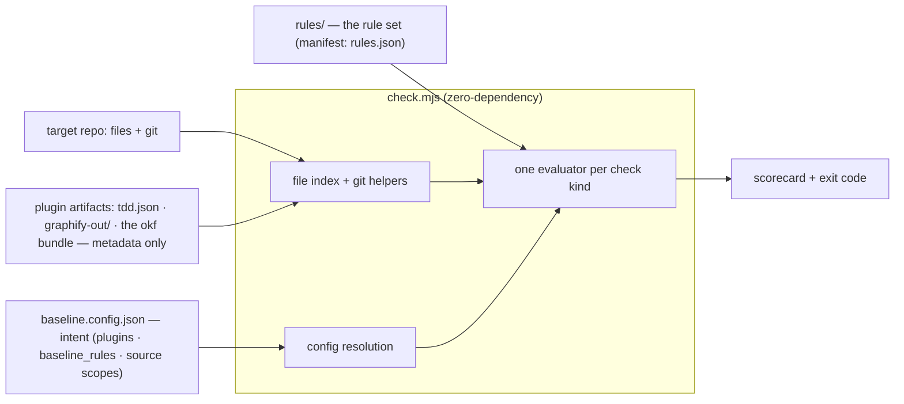
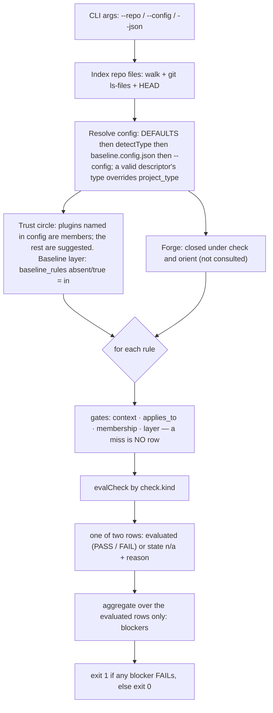
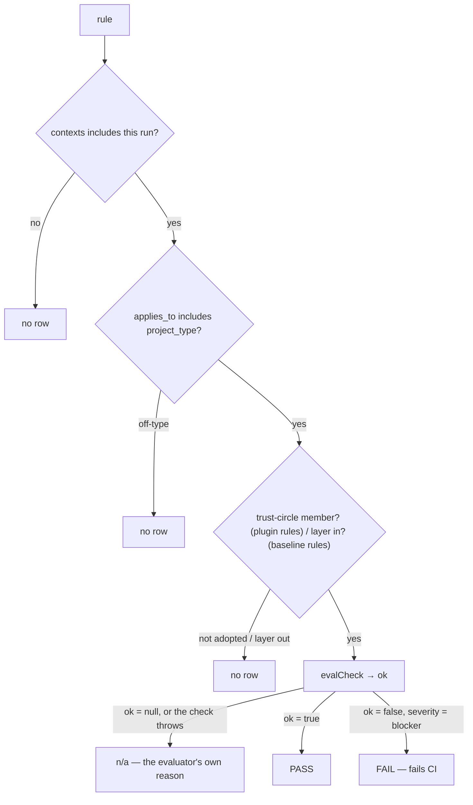

# project-baseline v4 — reference

> **This page is not an authority — the code is.** `rules/*.json`, `src/evaluators.mjs` and `check.mjs` decide; this page only
> describes them. Where the two disagree, the code is right and this page is a bug.
> The rule table and the check-kind list below are **generated** from them — never hand-edited.

A **testable readiness standard**. Every lesson is a rule; a zero-dependency runner scores a repo at rest and **fails CI on the blockers**. There is no warn tier, and no rule sits behind an opt-in switch: every rule that claims a severity is a blocker, a rule with no subject in the tree resolves `n/a` (excluded from the gate), and the one rule that claims no severity is frozen. What a machine cannot check is not a rule.

> The throughline: *don't trust a written promise — make something check it.* A checklist doc would just become another thing that drifts. This is the checklist as an exit code.

> **New to the jargon?** Terms like [blocker](GLOSSARY.md#blocker), [n/a](GLOSSARY.md#na), [plugin](GLOSSARY.md#plugin), [member](GLOSSARY.md#member), [trust circle](GLOSSARY.md#trust-circle), [stamp](GLOSSARY.md#stamp) and [orient](GLOSSARY.md#orient) are defined in the [glossary](GLOSSARY.md).

**Where the rule set came from.** v1 distilled its rules from three of the author's own repos; v2 pressure-tested them against the field's prior art — [OpenSSF Scorecard](GLOSSARY.md#openssf-scorecard), [SLSA](GLOSSARY.md#slsa), the [Twelve-Factor App](GLOSSARY.md#twelve-factor-app), Google's SRE books, [Diátaxis](GLOSSARY.md#diataxis), [Keep a Changelog](GLOSSARY.md#keep-a-changelog), [repolinter](GLOSSARY.md#repolinter), Stryker, and more — each candidate adversarially verified before it earned a place. v4 cut the set to the thirteen rules a machine can check at rest, and re-expressed the rest as two opt-ins with opposite defaults. The full history is in [CHANGELOG.md](CHANGELOG.md) and [v4/PLAN.md](v4/PLAN.md).

**How big is it?** Not stated here — a count in prose is the drift this repo exists to catch. `node check.mjs --self-check` derives the rule count, the blockers and the per-type coverage on every run; the [rule table](#the-rules) below is regenerated from the same source.

## The four-part shape

baseline is one part of four. It owns **verdicts** — deterministic, offline, one exit code. The rest is plugins, reached through file contracts only:

| piece | owns | reaches baseline via |
|---|---|---|
| **baseline** | verdicts | — |
| **obsidian-tdd** | what is open (red/green tests) | `tdd.json`, committed |
| **graphify** | what is where (code structure) | `graphify-out/`, local, gitignored |
| **okf-rag** | why things matter (prose, rationale) | a bundle at `$BASELINE_OKF_BUNDLE`; `get_knowledge()` for agents |
| **my-onto** | the ontology (declared, not built) | no path yet — the rule is frozen |

baseline imports no code from any of them and runs to a complete verdict with all four absent. See [Plugins](#plugins--membership-not-presence).

## Project types and `applies_to`

Every rule declares an **`applies_to`** — the kind of repo it fits — checked against a closed set of project types:

`node` · `python` · `service` · `library` · `docs`

- `applies_to: "all"` — universal (secrets, `.env` hygiene, CODEOWNERS, the plugins, the context rules).
- `applies_to: ["node","python","service","library"]` — **code repos only** (BUILD-03's CI workflow); on a `docs` repo it produces no row.
- `applies_to: ["node","python","service"]` — BUILD-04's env template; `library` and `docs` repos produce no row.

`project_type` auto-detects (`package.json` ⇒ `node`/`service`, `pyproject.toml` ⇒ `python`, `go.mod` ⇒ `service`, else `docs`) and can be pinned in `baseline.config.json` — or **declared in `baseline.repo.json`**, whose `type` supersedes auto-detection. A rule whose `applies_to` doesn't include your type is not part of the run — no row.

**Integrity gate — so a scope can't silently dangle.** A mistyped scope (`"nodejs"`, `"doc"`) would make a rule quietly never run. The rule set validates itself:

```bash
node check.mjs --self-check
```

It exits 1 on any rule missing `applies_to`, or naming an unknown type / check kind / severity / category, a duplicate id or slug, or a retired v2 key — and prints the **coverage matrix** (how many rules apply to each type) and the tool vocabulary (empty since the v4 cut). Wire it into CI so a malformed rule set can't merge.

## Why it's shaped this way

Three failure layers showed up across the original repos, and the drift **climbs** as a project matures:
- **Code / tests / CI** — broken in the pre-code repos (no scaffolding), solid in the mature one.
- **Narrative docs** — became the mature repo's #1 risk (stale resume marker, un-superseded ADR).
- **Headline claims** — falsified in the pre-code repos by shipping prior art.

The rule set keeps the bias — everything a machine can verify at rest — and drops the enforcement of a workflow that no longer exists. What survives is the unambiguous core: the build has CI and a secret template, secrets stay out, real env files stay ignored, every path has an owner, adopted tools keep their promises, and the context a repo wires in is not silently stale.

## Architecture & data flow

The whole thing is zero-dependency Node (`check.mjs` as the thin CLI over `src/`: repo index · config · evaluators · engine · report): it indexes the repo, resolves config, then walks every rule through the same gate → evaluate → tag pipeline. Plugin artifacts enter as **metadata only** — exists, file or directory, mtime, gitignore state — never as content.



**The run.** One pass: build the file index and git state, resolve config (defaults → auto-detected `project_type` → `baseline.config.json` → `--config`, then a valid descriptor's `type`), resolve the trust circle and the baseline layer, close the forge for this run, then walk every rule through the gates and reduce the evaluated rows to a blocker count and an [exit code](GLOSSARY.md#exit-code).



**Per-rule gates → one of two rows.** Every rule runs the same funnel, and it ends in exactly one of two shapes. A **gate miss** — outside this context, off-type, a plugin not adopted, the layer opted out — means the rule is **not part of the run: no row at all**. A rule that is **in scope but not evaluable here** — no subject in the tree, an evaluator returning `ok: null` or throwing — is an **n/a row**: `{ "id", "state": "n/a", "reason" }` in `--json` (no tag; the reason is never empty), hidden entirely from the human render, and outside `summary.total`, which counts evaluated rows only. Only a blocker that evaluates to `false` fails CI.



**The `--json` shape.** `results[]` carries every row in both shapes; `summary` is `{ blockers, pass, fail, total }` where **`total` is the number of evaluated rows** (n/a rows are in `results` but in no count); `trust: { members, suggested }` and `baseline: { layer, source, key, rules }` name the two opt-ins; `provenance: { knowledge: "not-consulted" }` records that `check` never read the knowledge bundle (that is `explain`'s plane). A plugin finding row also carries `log`, the path of the file it wrote.

```json
{ "id": "SEC-01-no-committed-secrets", "tag": "PASS", "detail": "pattern not found (good)" }
{ "id": "PLUG-02-graphify", "tag": "FAIL", "detail": "graphify not found at graphify-out — install: pip install graphifyy", "log": ".baseline/log/PLUG-02.log" }
```

## Quickstart
```bash
# 1. drop the toolkit in (e.g. tools/baseline/) — or ./install.sh for an agent skill dir
cp -r baseline-skill tools/baseline

# 2. declare intent (copy + edit) — plugins, baseline_rules, source scopes
cp tools/baseline/config.example.json baseline.config.json

# 3. run it
node tools/baseline/check.mjs          # human-readable scorecard, exit 1 on blockers
node tools/baseline/check.mjs --json   # machine output for CI
node tools/baseline/check.mjs --self-check   # validate the rule set and print derived counts
```
No install, no dependencies — needs only Node ≥ 18 and `git`.

## Wire it into CI (the point)
```yaml
  baseline:
    runs-on: ubuntu-latest
    steps:
      - uses: actions/checkout@<sha>
      - uses: actions/setup-node@<sha>
        with: { node-version: 22 }
      - run: node tools/baseline/check.mjs
```
Make `baseline` a required status check. Now the standard can't rot — it's enforced on every PR.

## The verbs

`baseline.mjs` is the entry point; `check` is the default and delegates to `check.mjs`.

| verb | what it does |
|---|---|
| `check [--repo DIR] [--json]` | score a repo — the scorecard above; exit 1 only on a blocker |
| `check --self-check` | validate the rule set and print the derived counts and coverage matrix |
| `orient [--repo DIR] [--json]` | the session-start survey: five lines (`repo:` · `work:` · `graph:` · `knowledge:` · `score:`), derived from the tree and plugin metadata. Read-only toward the repo, no forge, never a gate — exit 0 whatever it finds. Fetches first and notes how far behind origin the branch is; never pulls. `--json` carries the repo head, the plugin states and the score |
| `explain <rule-id> [--json]` | what a rule checks and why: its title and rationale from the rule set, plus the concept at `$BASELINE_OKF_BUNDLE/baseline/rules/<id lowercase>.md` when a bundle is configured — **display only, never a verdict**. Resolves the full id or the two-part prefix (`SEC-01`); degrades to the title with the bundle absent, exit 0 |
| `explain --audit [--json]` | every rule id resolves to a concept **file** in the bundle — by filename, no concept is opened; exit 1 on a hole |
| `trust setup / add / remove / stamp / verify / wire` | the trust circle and the baseline layer — see [Plugins](#plugins--membership-not-presence) and [the baseline rules layer](#the-baseline-rules-layer--the-other-opt-in-and-the-only-one-that-is-in-by-default) |
| `gen index` / `gen --check` / `gen migrate-claims` / `gen okf-concepts` | the generated index view and its CI drift guard; the claims-monolith migration; the staged okf-concept extraction — see [Generated views](#generated-views--gen-index--gen---check) |
| `admit`, `reconcile`, `log`, `jdg`, `scrub` | the records-and-merge verbs — [Records](#records--the-write-gate). They are outside the always-on gate |

## Plugins — membership, not presence

baseline is workflow scaffolding, and the plugins ship as **suggestions**: offered to every repo, gating none of them until the repo adopts one. Install is per approval — baseline prints the install command and never runs it.

**The boundary is metadata.** For a plugin artifact baseline may read: does the path exist, is it a file or a directory, its mtime, and its gitignore state. It never opens the artifact — no `covers[]` out of `tdd.json`, no `Built from commit:` out of `GRAPH_REPORT.md`, no concept body during `check`. `explain` may *display* a concept from the OKF bundle; display is not a verdict.

**One rule per plugin — the `PLUG` family.** Each plugin is exactly one rule, category `plugins`, severity `blocker`, kind `plugin-presence`, in `rules/plug.json`:

| rule | plugin | default artifact | default gitignore state |
|---|---|---|---|
| `PLUG-01` | obsidian-tdd | `tdd.json` (file) | tracked |
| `PLUG-02` | graphify | `graphify-out/` (directory) | ignored |
| `PLUG-03` | okf-rag | the bundle at `$BASELINE_OKF_BUNDLE` (directory) | ignored; the question is skipped when the path is outside the repo |

**Membership decides whether the rule gates.** The table above is what baseline *supports*; the trust circle is what a repo *adopted*, and adoption is a fact about the config, never a guess about the tree:

| standing | how it is stated | verdict |
|---|---|---|
| **member** | the plugin's **name is a key** of `baseline.config.json` `plugins` | the rule gates: artifact absent → **FAIL naming the install command**; present but the gitignore state differs from config → **FAIL naming the mismatch** (the config value and git's answer); otherwise **PASS**. A FAIL exits 1 |
| **suggested** | the key is absent — the shipped default, untouched | **`n/a`**, excluded from the exit gate, no log. baseline offers the tool in the report and in `baseline trust setup`; it can never fail a build |
| **declined** | the key is present with `false` or `null` | `n/a`, exactly like suggested — the decision is simply on the record |

So *absent and not a member* is `n/a`; *member and missing* is a blocker. A repo that adopted nothing scores green on the plugin family, and one that adopted a tool gets the gate it asked for. A plugin never produces a second row. The finding is a `check` row (CI sees it), not an `orient` line.

Key presence is what makes membership a fact rather than a guess: `{"graphify": {}}` adopts at the shipped defaults and is indistinguishable *in value* from a repo that wrote nothing — but not *in key*. `$BASELINE_OKF_BUNDLE` sets a member's path and never creates membership, because CI clones tracked files and not a shell.

**The only git question baseline asks about a member is "tracked or ignored, per the user's setup".** Config key **`plugins`**, keyed by plugin name, one entry per adopted plugin — `{ "path": <relative path>, "ignored": true|false }` — with the defaults above; `ignored: false` means *tracked*:

```json
{ "plugins": { "graphify": { "path": "graphify-out", "ignored": true }, "obsidian-tdd": {} } }
```

**Joining and leaving.** `baseline trust add <tool>` writes the key (`--path`, `--ignored` to override the defaults); `baseline trust remove <tool>` deletes it and the tool goes back to being a suggestion. `baseline trust setup [--repo DIR]` prints every supported tool, whether this repo adopted it, its integrity tier, and — when nothing is adopted — the recommended `plugins` block to copy. `check` names the circle on a `Trust circle` line and in `--json` under `trust: { members, suggested }`.

**Stamps — the evidence CI never sees.** A member's derived artifact is what the context rules gate on, and CI clones tracked files, not the artifact. `baseline trust stamp` writes the committed receipt under `.baseline/trust/<member>.json`; `baseline trust verify` rechecks it against the tree. graphify's stamp is **verifiable** — per-file content hashes baseline recomputes (exit 1 on stale or broken); okf-rag's is **RECORDED-ONLY** — a claim baseline orders but cannot verify, and says so on every surface. `baseline trust wire` installs the orientation entrypoint `.baseline/orient.sh` (CTX-19 checks byte-identity).

### The baseline rules layer — the other opt-in, and the only one that is IN by default

Membership above is the opt-**in** half of the rule set. Every rule that is *not* a plugin rule — `BUILD-03`, `BUILD-04`, `GOV-03`, `SEC-01`, `SEC-02`, `CTX-19`: the tree reads any repo can answer — is one **layer**, opted in or out **at setup time**, and its default is **in**. The asymmetry is the product: adopting a tool is a choice a repo makes, whereas the baseline is what you get by standing still.

Config key **`baseline_rules`**, and it follows membership's discipline — the fact is read off the config text, never guessed from the tree. What differs is which way the *absence* points:

| value | layer | meaning |
|---|---|---|
| key absent | **in** | the default. Those rules gate, exactly as they did before the layer existed |
| `true` | **in** | the same run, said out loud |
| `false` | **out** | every baseline rule resolves **`n/a`** — no finding, no exit code — the same treatment an unadopted plugin gets |
| anything else | **in** | only the literal `false` opts out: **in** is the safe direction, so no typo can quietly stop a rule from gating |

**It is never silent.** `check` prints a `Baseline layer` line on every run — in *and* out, naming every muted rule when it is out — and `--json` carries `baseline: { layer, source, key, rules }` beside `trust`. An opt-out is a decision on the record, not a hiding place.

**The layer does not reach the trust circle.** A member's `PLUG` rule keeps gating with the layer out; one key can never mute the whole rule set.

**Choosing.** `baseline trust setup --baseline-rules in|out` is what writes it: `out` writes `"baseline_rules": false`, and `in` **deletes** the key, because an absent key *is* in. Plain `baseline trust setup` prints the layer's state, the rules it governs, and changes nothing.

**Every finding leaves a log.** A `PLUG` finding row prints the path **`.baseline/log/<PREFIX-NN>.log`** (`.baseline/log/PLUG-02.log`); the file records the paths inspected, the config values used, and the gitignore answer, so the finding can be investigated without re-running. It is overwritten each run and removed when the row returns to PASS. `--json` carries the same path as `log`. `.baseline/log/` joins `.baseline/cache/` in the gitignore template.

**The forge is closed under `check` and `orient`.** Neither verb ever spawns `gh`; the forge-sourced probes live only in `admit` and `reconcile`, which are outside the always-on gate.

## Generated views — `gen index` + `gen --check`

A **generated view** is a tracked markdown file whose first line is the marker `<!-- baseline:generated <kind> — do not edit by hand; regenerate: baseline gen <kind> -->` — static bytes, no hash, no timestamp, no version. One kind ships:

```
baseline gen index [--repo DIR] [--out PATH]     # write the view (default docs/INDEX.md)
baseline gen --check [--repo DIR]                # regenerate every marked view, byte-compare (CI drift guard)
baseline gen migrate-claims [--repo DIR]         # explode a legacy docs/CLAIMS.json into records/claims/CLM-NNNN.json
baseline gen okf-concepts [--repo DIR]           # stage one proposed okf concept per rule under .baseline/proposed/ (never the bundle)
```

`gen index` derives a **deterministic** index — the judgments/claims ledgers, session-record counts (newest date from the *filename*, the tool's one recency truth; pool = tracked ∪ walked, so the record `baseline log` just wrote rides the same regeneration) and a docs map (first-heading titles, filename fallback; generated views excluded) — everything sorted, links **relative to the out file's directory**. It writes over its own marker or into absence and **refuses a file without the marker** (move it aside or pass a different `--out` — never paste the marker onto a hand-written file).

`gen --check` discovers marked views over the tracked ∪ walked pool with **uncapped reads**, regenerates each in memory, and byte-compares. Zero marked views → exit 0, trivially green — the pre-adoption state. Drift → exit 1 with a **verbatim-runnable remedy** derived from the invocation itself (a vendored consumer has no `baseline` on PATH). Wire it as an **advisory CI job — visibly red, outside the required set, never `continue-on-error: true`**.

**Vendoring a copy** (`tools/baseline/`) is plain `cp -r` and a same-PR bump when you update it; v4 keeps no lock file and no rule about the vendored tree's freshness — reading a commit out of an artifact is the plugin-data parse the metadata boundary forbids.

## Configuration

Everything auto-detects; override only what you need in `baseline.config.json` (see `config.example.json`). The keys that matter:

| key | what it does |
|---|---|
| `project_type` | `node`\|`service`\|`python`\|`library`\|`docs`. Pins the type (auto-detected otherwise); a valid descriptor's `type` supersedes both. Governs `applies_to` |
| `plugins` | per-plugin `{ path, ignored }`, keyed `obsidian-tdd` \| `graphify` \| `okf-rag` — where the artifact lives and whether git is expected to ignore it (`ignored: false` = tracked). Defaults: `tdd.json` tracked, `graphify-out/` ignored, the okf bundle ignored. The key's presence **is** membership — the trust circle |
| `baseline_rules` | the **baseline rules layer**: `false` opts every non-plugin rule out (they resolve `n/a`, out of the exit gate); absent or `true` leaves the layer **in**, which is the default. Written by `baseline trust setup --baseline-rules in\|out`; the state is printed on every `check` |
| `test_state_sources` | the globs `tdd.json` is meant to track (CTX-16, obsidian-tdd). Empty = the rule resolves `n/a` |
| `knowledge_sources` | the globs the knowledge bundle indexes (CTX-17, okf-rag). Empty = the rule resolves `n/a` |

The two source scopes default to empty, so those rules resolve `n/a` (state `n/a` in `--json`, hidden from the human render) until you adopt the convention — no nagging a repo that hasn't opted in. There is no day-threshold twin for either: "behind" is an ordering, not a deadline.

## Records & the write gate

The stored surface the checker can't derive is the **records** — one unit per file, schema-bound:

| kind | home | schema |
|---|---|---|
| session | `records/sessions/<branch>/<YYYY-MM-DD>-<HHMMSS>-<agent>.md` | `schema/record.session.schema.json` |
| judgment | `records/judgments/JDG-NNNN.json` (deviation · risk-acceptance · break-glass) | `schema/record.judgment.schema.json` |
| claim | `records/claims/CLM-NNNN.json` | `schema/record.claim.schema.json` |
| decision | `records/decisions/ADR-NNNN.md` (header fields) | `schema/record.adr.schema.json` |

Write sessions with the CLI — one command, nothing to remember:

```bash
node baseline.mjs log -m "what happened and why" --next "the one most useful next step"
# branch, agent and timestamp derived · stdin accepted · never $EDITOR
```

Every write passes the **scrub gate** (`src/scrub.mjs`, one `scan()` shared by every layer): deterministic signatures (SEC-01 parity + JWT + fine-grained PAT) **block**; assignment/entropy heuristics **warn** (severity never exceeds certainty). A block is non-lossy — the draft survives under `.baseline/cache/` and the exact rerun is printed; a false positive becomes a dated judgment via `--allow <finding-id> --allow-reason "..."` in `.baseline/scrub-allowlist.json` (one flag surface across `log` and `jdg`; the finding id is a content-derived hash — the value itself is never stored). Filenames are collision-free by construction: no counters, `O_EXCL`, same-second-same-agent refuses loudly.

**The judgment ledger.** A judgment is dated, owned, scoped, reasoned — and it **expires**: `expected_state` snapshots the world it assumed (mismatch = **DRIFTED**), `tripwire` (`fact op value`; ops `eq|ne|gt|lt|exists|absent`) voids it (**TRIPPED**), `review_by` lapses it (**EXPIRED**); an unknown fact path is **UNRESOLVABLE** — surfaced, never guessed. `baseline jdg new --kind <deviation|risk-acceptance|break-glass> --subject <scope> --reason "..." --review-by <date>` writes one; `baseline jdg check` evaluates the ledger (exit 1 on tripped/expired/invalid). No rule is satisfied by a judgment: a judgment records a decision — it never stands in for a check. The hand-written forms live in **[CONTRACT.md](CONTRACT.md)**.

**What re-scans what landed.** The landed-record re-scan runs in `reconcile` — blob content at the tip, *what landed*, never the worktree — and fires on a deterministic finding anywhere you commit (heuristics stay soft). A push-time secret gate visible **at rest** (gitleaks-class CI wiring, a pre-commit hook, or a committed `scrub-pre-push` hook script) is the same intent, checked by the same `scan()`. Hand-written records get the scrub at the push boundary once the shipped hook is installed per clone (`cp tools/baseline/hooks/scrub-pre-push.sh .git/hooks/pre-push`), whose engine is `baseline scrub` (worktree files, or `--pushed SHA [--since SHA]` committed-blob ranges).

**Claims.** `baseline gen migrate-claims` explodes a legacy `docs/CLAIMS.json` monolith into per-claim `records/claims/CLM-NNNN.json` — `slug` preserves the old id, numbering continues past existing records, schema-invalid claims are refused loudly, reruns are idempotent. The claims checker reads **records only** — an unmigrated monolith is never counted. The stored-status surface is retired outright: `orient` is the status surface, everywhere.

**Admit and reconcile** (kept from v2, outside the always-on gate). `baseline admit` re-derives at the merge point and refuses (exit 1) on staleness — the target tip is not an ancestor of HEAD — on an admit-context blocker (a descriptor change without its same-range judgment), or on gating-source loss; the target ref's descriptor governs the run. `baseline reconcile` revalidates the default branch on cron and files what it finds as dedup'd, lifecycle-managed `baseline`-labeled issues — the tracker is its only write surface; exit 1 means delivery failed, never "findings exist". Both keep the live forge probe that `check` and `orient` do not have. Every admit verdict carries a `provenance: inputs_digest …` receipt naming exactly what it was derived from.

## The rules

[`blocker`](GLOSSARY.md#blocker) fails CI. There is no warn tier: a rule that claims a severity is a blocker, and the one rule that claims none is [frozen](GLOSSARY.md#frozen-rule) — it can never produce a verdict.

Every rule also declares **`sources`** (which ground-truth planes it reads: tree · history), **`on_unreachable`** (skip · fail · stale-ok), **`contexts`** (check · reconcile), and **`certainty`** (deterministic · heuristic). `--self-check` enforces the structural law that a **blocker must be deterministic**, and that severity `none` is legal only on a check that is structurally incapable of a verdict.

Ids carry three parts — `PREFIX-NN-semantic-slug` (`SEC-01-no-committed-secrets`): the id says what the rule checks, so a finding is readable with no lookup, and the two-part prefix still resolves in `explain` and in the okf bundle.

**The table below is generated** — `node docs/assets/gen-reference-rules.mjs` rewrites it from `loadRules()` (and `--check` fails CI when it is behind the rule set). Rerun it whenever `rules/` changes; a new family lands here by running it once. *Scope:* `applies_to`.

<!-- baseline:rules-table begin — generated by docs/assets/gen-reference-rules.mjs; edit rules/*.json (or the glosses in that script), then rerun it -->

### Build & execution

| ID | Rule | Severity | Scope |
|---|---|---|---|
| BUILD-03-ci-workflow-present | CI workflow present | 🔴 blocker | node, python, service, library |
| BUILD-04-env-template-present | Env/secret template present | 🔴 blocker | node, python, service |

### Security & supply-chain

| ID | Rule | Severity | Scope |
|---|---|---|---|
| SEC-01-no-committed-secrets | No high-signal secrets committed | 🔴 blocker | all |
| SEC-02-env-files-ignored | Real .env files are git-ignored, not committed | 🔴 blocker | all |

### Change governance

| ID | Rule | Severity | Scope |
|---|---|---|---|
| GOV-03-codeowners-names-owner | CODEOWNERS exists and names an owner | 🔴 blocker | all |

### Context management

| ID | Rule | Severity | Scope |
|---|---|---|---|
| CTX-15-graph-not-lagging-code | graphify's graph is not behind the code | 🔴 blocker | all |
| CTX-16-test-state-not-lagging-code | obsidian-tdd's test state is not behind the code | 🔴 blocker | all |
| CTX-17-knowledge-not-lagging-code | okf-rag's recorded indexing claim is not behind the code | 🔴 blocker | all |
| CTX-18-ontology-not-lagging-code | my-onto's ontology is not behind the code (frozen — my-onto does not exist yet) | ⚪ frozen · no severity | all |
| CTX-19-orientation-entrypoint-present | The orientation entrypoint is the one this baseline ships | 🔴 blocker | all |

### Plugins

| ID | Rule | Severity | Scope |
|---|---|---|---|
| PLUG-01-obsidian-tdd | obsidian-tdd artifact present and tracked | 🔴 blocker | all |
| PLUG-02-graphify | graphify graph present and gitignored | 🔴 blocker | all |
| PLUG-03-okf-rag | okf-rag bundle present | 🔴 blocker | all |

<!-- baseline:rules-table end -->

### Notes by family

- **Change governance.** The forge-sourced protection probes left the rule set in the v4 cut; the surviving rule reads the tree only — a committed CODEOWNERS naming an owner.
- **Records & ledger.** The landed-record re-scan targets **anything you commit**, not only `records/` — a secret committed outside `records/` fires it too. It runs in `reconcile`, not in `check`.
- **Repo descriptor.** A schema-validated `baseline.repo.json` (`type`, `lifecycle`, `maturity`, `workflow`, `anchoring`) is a declared identity, not a guess: its `type` supersedes filesystem auto-detection, and a change to it without a same-range judgment whose `subject` is exactly `baseline.repo.json` refuses admission (admit context only).
- **Plugins** (`PLUG` family). One blocker per **member** — a missing or mis-ignored artifact fails the build and leaves `.baseline/log/<PREFIX-NN>.log`. A non-member resolves n/a. See [Plugins](#plugins--membership-not-presence).
- **Context** (`CTX` family). Four trust-circle rules — graphify's graph (CTX-15), obsidian-tdd's test state (CTX-16), okf-rag's knowledge claim (CTX-17), my-onto's ontology (CTX-18, frozen) — gate on committed stamps, not on the artifacts CI never sees; the fifth (CTX-19) gates baseline's own orientation entrypoint on byte-identity. All five are deterministic without a clock: no mtime (it does not survive a clone) and no day threshold.

## Check kinds (how the runner verifies, with zero deps)

Every check kind is one evaluator in `src/evaluators.mjs`, registered in `CHECK_KINDS`; `--self-check` rejects a rule naming a kind that is not registered, and the registry and the kinds rules use are the same set — so "how many kinds" has one answer, printed by the tool. **The list below is generated** from the registry by the same script as the rule table.

<!-- baseline:check-kinds begin — generated by docs/assets/gen-reference-rules.mjs; edit rules/*.json (or the glosses in that script), then rerun it -->

- `any-file` — glob presence (`mode: absent`, `tracked_only`, `allow`)
- `artifact-not-lagging` — a trust-circle member's TRACKED artifact was not committed before the newest commit under its configured source scope — an ordering, with no day threshold; same commit passes
- `doc-code-age` — a git-date ordering with no standalone rule — kept because the artifact-not-lagging check inherits its arithmetic
- `file-contains` — the file exists AND matches
- `frozen` — structurally incapable of a verdict: always n/a, silent to humans, and the only kind that may claim no severity (a tool that does not exist yet)
- `graph-stamp-fresh` — the committed graphify stamp's content hashes still match the tracked code files — the check-pipeline face of `baseline trust verify`; the graph itself is never opened
- `grep` — regex present / absent / all over file contents (`tracked_only`)
- `orient-entrypoint` — the committed `.baseline/orient.sh` is BYTE-IDENTICAL to the one this baseline ships (`baseline trust wire` installs it) — identity, not existence; absence is n/a
- `plugin-presence` — a plugin artifact exists and its gitignore state matches the `plugins` config — metadata only, never the content
- `stamp-not-lagging` — the commit a RECORDED-ONLY stamp names is not behind the newest commit under its source scope — the claim is ordered, never verified, and every verdict says so

<!-- baseline:check-kinds end -->

A rule with a check the runner can't evaluate (bad regex, missing target, a thrown evaluator) resolves to **`state: "n/a"`** with the error as its reason, never a crash — one broken rule can't take down the run.

## What changed, by major version

- **v1 → v2.** The original build/test/context rules kept verbatim; v2 added the security & supply-chain block, code-quality gates, reproducibility, onboarding basics, change governance, deeper context checks, and the records ledger — each candidate adversarially verified against the field's prior art.
- **v2 → v3.** Three-part ids. The lane-workflow, divergence and merge-admission families, the records' append-only/one-home history checks, the vendored-lock check and every manual (sign-off) rule deleted — with their machinery. The plugin boundary, `explain` and `gen okf-concepts`, the five-line `orient`, the `SKILL.md` diet, every count derived.
- **v3 → v4.** The rule set cut to thirteen rules: every non-plugin rule became one **baseline layer** (opt-out, default in), and the plugin rules became the **trust circle** (opt-in, default out) gated by membership. There is no warn tier and no opt-in rule set — a rule is a blocker or it is frozen. The context rules gate on committed stamps and git dates, never on a clock. Historical detail: `docs/CHANGELOG.md`, `docs/v4/rule-review.md`.
